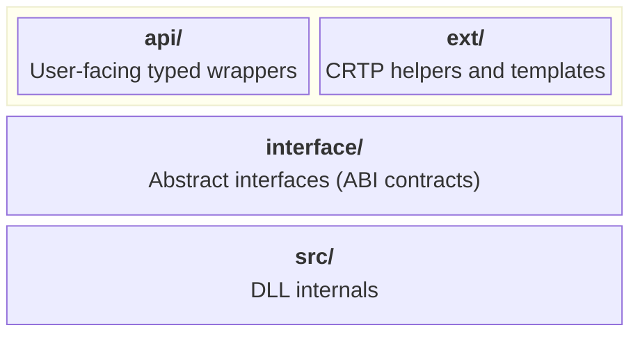
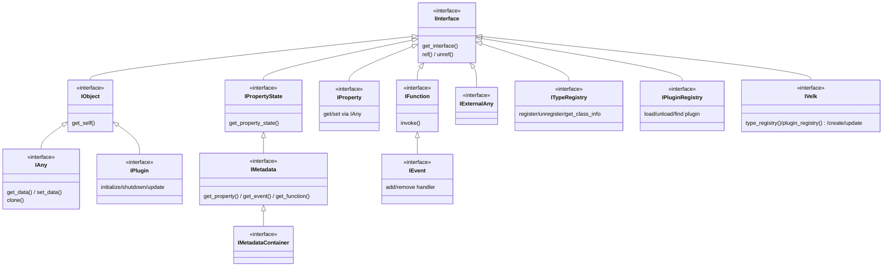
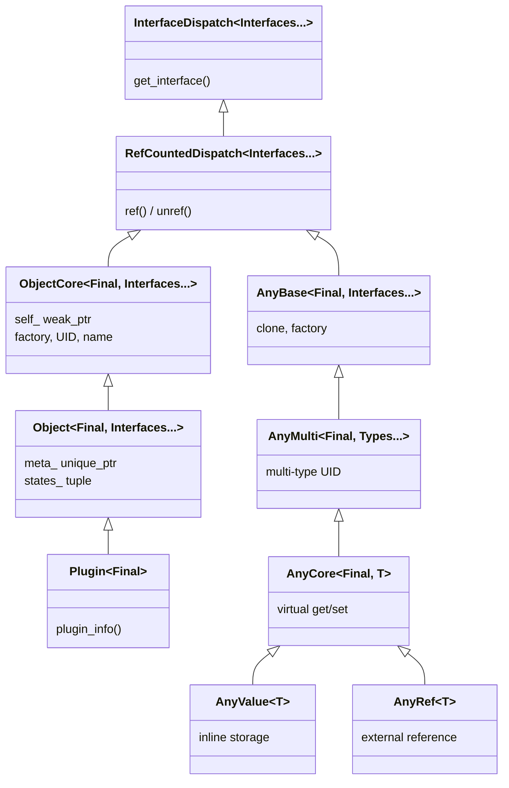

# Architecture

This document describes the general architecture and code division in Velk.

## Contents

- [Layers](#layers)
- [interface/](#interface)
- [ext/](#ext)
- [api/](#api)
- [src/](#src)
- [Type hierarchy across layers](#type-hierarchy-across-layers)
  - [Interface inheritance](#interface-inheritance)
  - [ext/ class hierarchy](#ext-class-hierarchy)
- [ABI stability](#abi-stability)
  - [STL replacement types](#stl-replacement-types)
  - [What makes these ABI-safe](#what-makes-these-abi-safe)
  - [shared_ptr dual mode](#shared_ptr-dual-mode)
  - [What is NOT replaced](#what-is-not-replaced)
- [Key types](#key-types)

## Layers

The library is organized in four layers:



```
velk/
  include/               Public headers (available to DLL consumers)
    interface/           Abstract interfaces (pure virtual)
    ext/                 CRTP helpers and template implementations for application-defined objects/types
    api/                 User-facing typed wrappers for API usage
    common.h             Uid, type_uid<T>(), get_name<T>()
    array_view.h         Lightweight constexpr span-like view
  src/                   Internal runtime implementations (compiled into DLL)
```

## interface/

Abstract interfaces (pure virtual). These define the ABI contracts.

| Header | Description |
|---|---|
| `intf_interface.h` | `IInterface` root with UID-based `get_interface()` and ref-counting; `Interface<T>` CRTP with auto UID |
| `intf_object.h` | `IObject` base with `get_self()` for shared_ptr retrieval |
| `intf_metadata.h` | `MemberDesc`, `IMetadata`, `IMetadataContainer`, `VELK_INTERFACE` macro |
| `intf_property.h` | `IProperty` with type-erased get/set and on_changed |
| `intf_event.h` | `IEvent` (inherits `IFunction`) with add/remove handler (immediate or deferred) |
| `intf_function.h` | `FnArgs` argument view, `IFunction` invocable callback with `InvokeType` support |
| `intf_any.h` | `IAny` type-erased value container |
| `intf_external_any.h` | `IExternalAny` for externally-managed data |
| `intf_type_registry.h` | `ITypeRegistry` for type registration and class info lookup |
| `intf_plugin.h` | `PluginInfo`, `PluginDependency`, `PluginConfig`, `IPlugin` interface, version helpers (`make_version`, `version_major/minor/patch`) |
| `intf_plugin_registry.h` | `IPluginRegistry` for loading/unloading plugins by instance or from shared libraries |
| `intf_velk.h` | `UpdateInfo`, `IVelk` for object creation, factory methods, and deferred tasks; delegates type registration to `ITypeRegistry` via `type_registry()` and plugin management to `IPluginRegistry` via `plugin_registry()` |
| `intf_object_factory.h` | `IObjectFactory` for instance creation |
| `types.h` | `ClassInfo`, `Duration`, `ReturnValue`, `interface_cast`, `interface_pointer_cast` |

## ext/

CRTP helpers and template implementations.

| Header | Description |
|---|---|
| `interface_dispatch.h` | `ext::InterfaceDispatch<Interfaces...>` generic `get_interface` dispatching across a pack of interfaces (walks parent interface chain) |
| `refcounted_dispatch.h` | `ext::RefCountedDispatch<Interfaces...>` extends `InterfaceDispatch` with intrusive ref-counting |
| `core_object.h` | `ext::ObjectFactory<T>` singleton factory; `ext::ObjectCore<T, Interfaces...>` CRTP with factory, self-pointer |
| `object.h` | `ext::Object<T, Interfaces...>` adds `IMetadata` support with collected metadata |
| `metadata.h` | `ext::TypeMetadata<T>`, `ext::CollectedMetadata<Interfaces...>` constexpr metadata collection |
| `any.h` | `ext::AnyBase`, `ext::AnyMulti<Types...>`, `ext::AnyCore<T>`, `ext::AnyValue<T>` |
| `event.h` | `ext::LazyEvent` helper for deferred event creation |
| `plugin.h` | `ext::Plugin<T>` CRTP base for plugins; `VELK_PLUGIN_UID/NAME/VERSION/DEPS` macros; `VELK_PLUGIN` export macro |

## api/

User-facing typed wrappers.

| Header | Description |
|---|---|
| `velk.h` | `instance()` singleton access |
| `property.h` | `ConstProperty<T>` read-only and `Property<T>` typed property wrappers |
| `any.h` | `Any<T>` typed any wrapper |
| `callback.h` | `Callback` creator with lambda support (constructs new IFunction instances) |
| `function.h` | `Function` wrapper around existing IFunction, variadic `invoke_function` overloads |
| `event.h` | `Event` wrapper around existing IEvent |
| `function_context.h` | `FunctionContext` view for multi-arg access with count validation |

## src/

Internal runtime implementations (compiled into the DLL).

| File | Description |
|---|---|
| `velk_instance.cpp/h` | `VelkInstance` implementing `IVelk`, `ITypeRegistry`, and `IPluginRegistry` |
| `library_handle.h` | Platform-abstracted shared library loading (`LoadLibrary`/`dlopen`) |
| `platform.h` | Platform-specific OS includes (`windows.h`, `dlfcn.h`, `pthread.h`) |
| `metadata_container.cpp/h` | `MetadataContainer` implementing `IMetadata` with lazy member creation |
| `property.cpp/h` | `PropertyImpl` |
| `function.cpp/h` | `FunctionImpl` (implements `IEvent`, which inherits `IFunction`) |
| `velk.cpp` | DLL entry point, exports `instance()` |

## Type hierarchy across layers

### Interface inheritance



### ext/ class hierarchy



Each concept in Velk has types at up to three layers. The naming follows a consistent pattern:

- **`I` prefix** — pure virtual interface (ABI contract)
- **`Core` suffix** — minimal CRTP base (extend for custom behavior)
- **`Value` / `Simple` / no suffix** — ready-to-use concrete or full-featured base
- **`T` suffix** — typed api wrapper that users hold by value

| Concept | interface/ | ext/ | api/ |
|---------|-----------|------|------|
| **Any** | `IAny` | `ext::AnyBase` | `Any<T>` |
| | | `ext::AnyMulti<Types...>` | |
| | | `ext::AnyCore<Final, T>` | |
| | | `ext::AnyValue<T>` | |
| **Object** | `IObject` | `ext::ObjectCore<Final, Intf...>` | — |
| | | `ext::Object<Final, Intf...>` | |
| **Property** | `IProperty` | — | `ConstProperty<T>`, `Property<T>` |
| **Function** | `IFunction` | — | `Function` (wrapper), `Callback` (creator) |
| **Event** | `IEvent` | `ext::LazyEvent` | `Event` (wrapper) |
| **Plugin** | `IPlugin`, `IPluginRegistry` | `ext::Plugin<Final>` | — |

**Any hierarchy** (ext/) — three levels for different extension points:

| Class | Role | When to use |
|-------|------|-------------|
| `ext::AnyBase<Final, Intf...>` | Internal base with ref-counting, clone, factory | Rarely used directly |
| `ext::AnyMulti<Final, Types...>` | Multi-type compatible any | When an any must expose multiple type UIDs |
| `ext::AnyCore<Final, T, Intf...>` | Single-type with virtual get/set | Extend for custom storage (external data, shared state) |
| `ext::AnyValue<T>` | Inline storage, ready to use | Default choice for simple typed values |

**Object hierarchy** (ext/) — two levels:

| Class | Role | When to use |
|-------|------|-------------|
| `ext::ObjectCore<Final, Intf...>` | Minimal base (no metadata) | Internal implementations (`PropertyImpl`, `FunctionImpl`, `VelkInstance`) |
| `ext::Object<Final, Intf...>` | Full base with metadata collection | User-defined types with `VELK_INTERFACE` |
| `ext::Plugin<Final>` | Plugin base with static metadata | Plugin implementations |

## ABI stability

Velk is distributed as a shared library (DLL/.so). Consumers compile against the public headers and link the DLL at runtime. This means every type that crosses the DLL boundary, function parameters, return values, struct members in public interfaces, must have an **identical memory layout** regardless of which compiler, standard library, or build flags the consumer uses.

The C++ Standard Library does not guarantee ABI stability. `std::string_view`, `std::shared_ptr`, `std::span`, and other vocabulary types vary in size, alignment, and internal layout across compiler vendors and even between major versions of the same vendor. Passing an `std::shared_ptr` created by MSVC 2019 to code compiled with MSVC 2022 (or Clang, or a different STL implementation) is undefined behavior if the layouts differ.

Velk's solution to this is to provide its own vocabulary types with fixed, documented layouts. These types are intentionally minimal, they implement only what the library needs, avoiding the full generality (and corresponding complexity) of their STL counterparts.

### STL replacement types

| Velk type | STL equivalent | Layout | Purpose |
|---|---|---|---|
| `string_view` | `std::string_view` | `{const char*, size_t}` = 16 bytes | Non-owning string reference in interface signatures and metadata |
| `array_view<T>` | `std::span<const T>` | `{const T*, size_t}` = 16 bytes | Constexpr view over contiguous data (metadata arrays, member lists) |
| `shared_ptr<T>` | `std::shared_ptr<T>` | `{T*, control_block*}` = 16 bytes | Shared ownership across DLL boundary with weak reference support |
| `weak_ptr<T>` | `std::weak_ptr<T>` | `{T*, control_block*}` = 16 bytes | Non-owning observer that can attempt to lock a `shared_ptr` |
| `refcnt_ptr<T>` | `std::shared_ptr<T>` (intrusive) | `{T*}` = 8 bytes | Lightweight intrusive refcounted pointer (no control block) |
| `Uid` | — | `{uint64_t, uint64_t}` = 16 bytes | 128-bit type/interface identifier (constexpr FNV-1a or user-specified) |

### What makes these ABI-safe

1. **POD or near-POD layout.** Each type is a simple struct with primitive members (`T*`, `size_t`, `uint64_t`). No virtual functions, no inheritance, no compiler-generated padding surprises. The layout is the same on any C++17 compiler targeting the same platform.

2. **No STL in the interface.** Public interface methods never accept or return STL types. A consumer can use any standard library implementation internally. The DLL boundary only sees Velk types.

3. **Ref-counting lives in the object.** `IInterface` provides `ref()`/`unref()` virtuals. The `shared_ptr` calls these for IInterface-derived types, so the ref-counting logic is always in the DLL. Never duplicated or inlined differently across compilation units.

4. **Control block is DLL-allocated.** The `control_block` is created inside the DLL by `create_control_block()`. Both the DLL and the consumer see the same 24-byte struct, but the DLL owns allocation and deallocation.

### shared_ptr dual mode

Velk's `shared_ptr<T>` operates in two modes depending on `T`:

- **IInterface-derived types**: Intrusive. `shared_ptr` calls `ref()`/`unref()` on the object and only uses the `control_block` for weak reference support. Multiple independent `shared_ptr` instances can be created from raw pointers to the same object. They all share the object's intrusive ref count.

- **Non-IInterface types** (e.g. `shared_ptr<int>`): External. A `control_block` is heap-allocated with a type-erased destructor, similar to `std::shared_ptr`. This mode is used internally but never crosses the DLL boundary.

The mode is selected at compile time via `std::is_convertible_v<T*, IInterface*>`.

### What is NOT replaced

Types that do not cross the DLL boundary can safely use STL types:

- `std::vector`, `std::unique_ptr`, `std::mutex`, `std::atomic` are used in internal implementations compiled into the DLL.
- `std::string` — used in user `State` structs (the state pointer is passed as `void*` through `IPropertyState`, so the DLL never interprets the layout).
- `std::tuple` — used in `ext::Object` for the states tuple, but only within user code that compiles against the same headers.

## Key types

| Type | Role |
|---|---|
| `string_view` | ABI-stable non-owning string reference (`{const char*, size_t}`); replaces `std::string_view` at DLL boundaries |
| `array_view<T>` | ABI-stable constexpr span-like view over contiguous const data (`{const T*, size_t}`); replaces `std::span` |
| `shared_ptr<T>` | ABI-stable shared ownership pointer (`{T*, control_block*}`); intrusive for IInterface types, external for others |
| `weak_ptr<T>` | ABI-stable non-owning observer (`{T*, control_block*}`); locks to a `shared_ptr` if the object is still alive |
| `refcnt_ptr<T>` | Lightweight intrusive refcounted pointer (`{T*}`); calls `ref()`/`unref()` directly, no control block |
| `control_block` | Shared ref-count block for `shared_ptr`/`weak_ptr` (`{atomic strong, atomic weak, destroy, ptr}` = 24 bytes) |
| `Uid` | 128-bit identifier for types and interfaces; constexpr FNV-1a from type names or user-specified |
| `Interface<T, Base>` | CRTP base for interfaces; provides `UID`, `INFO`, smart pointer aliases, `ParentInterface` typedef for dispatch chain walking |
| `ext::InterfaceDispatch<Interfaces...>` | Implements `get_interface` dispatching across a pack of interfaces and their parent interface chains |
| `ext::RefCountedDispatch<Interfaces...>` | Extends `InterfaceDispatch` with atomic ref-counting (`ref`/`unref`) |
| `ext::ObjectCore<T, Interfaces...>` | Minimal CRTP base for objects (without metadata); auto UID/name, factory, self-pointer |
| `ext::Object<T, Interfaces...>` | Full CRTP base; extends `ObjectCore` with metadata from all interfaces |
| `InvokeType` | Enum (`Immediate`, `Deferred`) controlling execution timing |
| `FnArgs` | Non-owning view of function arguments (`{const IAny* const* data, size_t count}`) with bounds-checked `operator[]` |
| `FunctionContext` | Lightweight view over `FnArgs` with count validation and typed `arg<T>(i)` access |
| `DeferredTask` | Nested struct in `IVelk` pairing an `IFunction::ConstPtr` with a cloned `std::vector<IAny::Ptr>` of args |
| `ConstProperty<T>` | Read-only typed property with `get_value()` and change events (returned by `RPROP` accessors) |
| `Property<T>` | Typed property with `get_value()`/`set_value()` and change events |
| `Any<T>` | Typed view over `IAny`; `IAny::clone()` creates a deep copy via the type's factory |
| `Function` | Lightweight wrapper around an existing `IFunction` pointer (returned by `FN`/`FN_RAW` accessors) |
| `Event` | Lightweight wrapper around an existing `IEvent` pointer (returned by `EVT` accessors) |
| `Callback` | Creates and owns an `IFunction` from `ReturnValue(FnArgs)` callbacks or typed lambdas |
| `ext::LazyEvent` | Helper that lazily creates an `IEvent` on first access via implicit conversion |
| `ext::Plugin<T>` | CRTP base for plugin implementations; collects static metadata (name, version, dependencies) via SFINAE |
| `PluginInfo` | Static plugin descriptor: factory, name, version, dependencies; accessible without an instance via `Plugin<T>::plugin_info()` |
| `PluginConfig` | Per-plugin configuration set during `initialize`: `retainTypesOnUnload`, `enableUpdate` |
| `PluginDependency` | Plugin dependency entry: UID and optional minimum version |
| `Duration` | Type-safe microsecond duration (`{int64_t us}`) used in `UpdateInfo` and `IVelk::update()` |
| `UpdateInfo` | Time information passed to plugin `update()`: `timeSinceInit`, `timeSinceFirstUpdate`, and `timeSinceLastUpdate` (all `Duration`) |
| `MemberDesc` | Describes a property, event, or function member |
| `ClassInfo` | UID, name, `array_view<InterfaceInfo>` of implemented interfaces, and `array_view<MemberDesc>` for a registered class |
