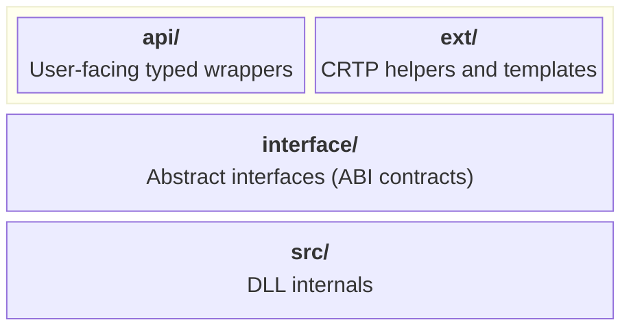
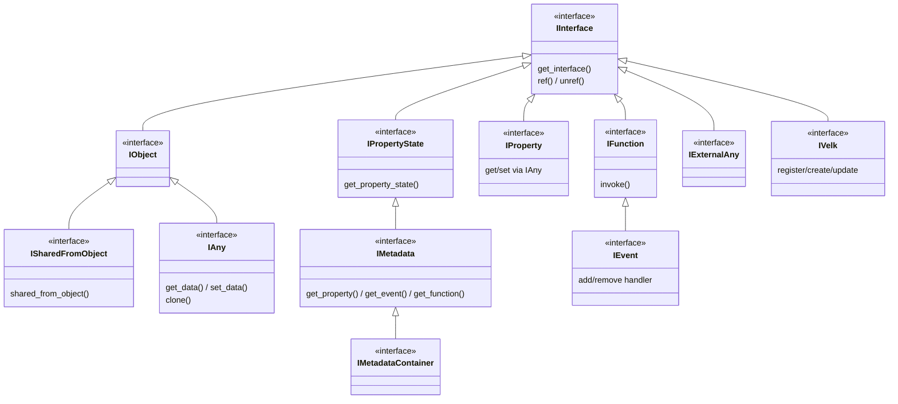
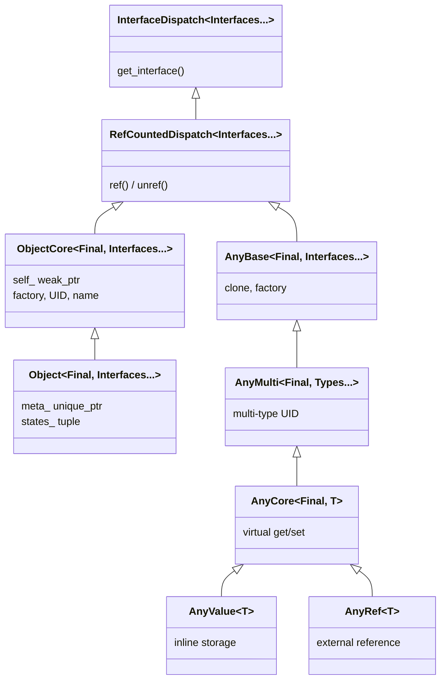

# Architecture

This document describes the general architecture and code division in Velk.

## Contents

- [Layers](#layers)
- [interface/](#interface)
- [ext/](#ext)
- [api/](#api)
- [src/](#src)
- [Type hierarchy across layers](#type-hierarchy-across-layers)
  - [Interface inheritance](#interface-inheritance)
  - [ext/ class hierarchy](#ext-class-hierarchy)
- [Key types](#key-types)

## Layers

The library is organized in four layers:



```
velk/
  include/               Public headers (available to DLL consumers)
    interface/           Abstract interfaces (pure virtual)
    ext/                 CRTP helpers and template implementations for application-defined objects/types
    api/                 User-facing typed wrappers for API usage
    common.h             Uid, type_uid<T>(), get_name<T>()
    array_view.h         Lightweight constexpr span-like view
  src/                   Internal runtime implementations (compiled into DLL)
```

## interface/

Abstract interfaces (pure virtual). These define the ABI contracts.

| Header | Description |
|---|---|
| `intf_interface.h` | `IInterface` root with UID-based `get_interface()` and ref-counting; `Interface<T>` CRTP with auto UID |
| `intf_object.h` | `IObject` base, `ISharedFromObject` for self-pointer |
| `intf_metadata.h` | `MemberDesc`, `IMetadata`, `IMetadataContainer`, `VELK_INTERFACE` macro |
| `intf_property.h` | `IProperty` with type-erased get/set and on_changed |
| `intf_event.h` | `IEvent` (inherits `IFunction`) with add/remove handler (immediate or deferred) |
| `intf_function.h` | `FnArgs` argument view, `IFunction` invocable callback with `InvokeType` support |
| `intf_any.h` | `IAny` type-erased value container |
| `intf_external_any.h` | `IExternalAny` for externally-managed data |
| `intf_velk.h` | `IVelk` for type registration and object creation |
| `intf_object_factory.h` | `IObjectFactory` for instance creation |
| `types.h` | `ClassInfo`, `ReturnValue`, `interface_cast`, `interface_pointer_cast` |

## ext/

CRTP helpers and template implementations.

| Header | Description |
|---|---|
| `interface_dispatch.h` | `ext::InterfaceDispatch<Interfaces...>` generic `get_interface` dispatching across a pack of interfaces (walks parent interface chain) |
| `refcounted_dispatch.h` | `ext::RefCountedDispatch<Interfaces...>` extends `InterfaceDispatch` with intrusive ref-counting |
| `core_object.h` | `ext::ObjectFactory<T>` singleton factory; `ext::ObjectCore<T, Interfaces...>` CRTP with factory, self-pointer |
| `object.h` | `ext::Object<T, Interfaces...>` adds `IMetadata` support with collected metadata |
| `metadata.h` | `ext::TypeMetadata<T>`, `ext::CollectedMetadata<Interfaces...>` constexpr metadata collection |
| `any.h` | `ext::AnyBase`, `ext::AnyMulti<Types...>`, `ext::AnyCore<T>`, `ext::AnyValue<T>` |
| `event.h` | `ext::LazyEvent` helper for deferred event creation |

## api/

User-facing typed wrappers.

| Header | Description |
|---|---|
| `velk.h` | `instance()` singleton access |
| `property.h` | `ConstProperty<T>` read-only and `Property<T>` typed property wrappers |
| `any.h` | `Any<T>` typed any wrapper |
| `callback.h` | `Callback` creator with lambda support (constructs new IFunction instances) |
| `function.h` | `Function` wrapper around existing IFunction, variadic `invoke_function` overloads |
| `event.h` | `Event` wrapper around existing IEvent |
| `function_context.h` | `FunctionContext` view for multi-arg access with count validation |

## src/

Internal runtime implementations (compiled into the DLL).

| File | Description |
|---|---|
| `velk_impl.cpp/h` | `VelkImpl` implementing `IVelk` |
| `metadata_container.cpp/h` | `MetadataContainer` implementing `IMetadata` with lazy member creation |
| `property.cpp/h` | `PropertyImpl` |
| `function.cpp/h` | `FunctionImpl` (implements `IEvent`, which inherits `IFunction`) |
| `velk.cpp` | DLL entry point, exports `instance()` |

## Type hierarchy across layers

### Interface inheritance



### ext/ class hierarchy



Each concept in Velk has types at up to three layers. The naming follows a consistent pattern:

- **`I` prefix** — pure virtual interface (ABI contract)
- **`Core` suffix** — minimal CRTP base (extend for custom behavior)
- **`Value` / `Simple` / no suffix** — ready-to-use concrete or full-featured base
- **`T` suffix** — typed api wrapper that users hold by value

| Concept | interface/ | ext/ | api/ |
|---------|-----------|------|------|
| **Any** | `IAny` | `ext::AnyBase` | `Any<T>` |
| | | `ext::AnyMulti<Types...>` | |
| | | `ext::AnyCore<Final, T>` | |
| | | `ext::AnyValue<T>` | |
| **Object** | `IObject` | `ext::ObjectCore<Final, Intf...>` | — |
| | | `ext::Object<Final, Intf...>` | |
| **Property** | `IProperty` | — | `ConstProperty<T>`, `Property<T>` |
| **Function** | `IFunction` | — | `Function` (wrapper), `Callback` (creator) |
| **Event** | `IEvent` | `ext::LazyEvent` | `Event` (wrapper) |

**Any hierarchy** (ext/) — three levels for different extension points:

| Class | Role | When to use |
|-------|------|-------------|
| `ext::AnyBase<Final, Intf...>` | Internal base with ref-counting, clone, factory | Rarely used directly |
| `ext::AnyMulti<Final, Types...>` | Multi-type compatible any | When an any must expose multiple type UIDs |
| `ext::AnyCore<Final, T, Intf...>` | Single-type with virtual get/set | Extend for custom storage (external data, shared state) |
| `ext::AnyValue<T>` | Inline storage, ready to use | Default choice for simple typed values |

**Object hierarchy** (ext/) — two levels:

| Class | Role | When to use |
|-------|------|-------------|
| `ext::ObjectCore<Final, Intf...>` | Minimal base (no metadata) | Internal implementations (`PropertyImpl`, `FunctionImpl`, `VelkImpl`) |
| `ext::Object<Final, Intf...>` | Full base with metadata collection | User-defined types with `VELK_INTERFACE` |

## Key types

| Type | Role |
|---|---|
| `Uid` | 128-bit identifier for types and interfaces; constexpr FNV-1a from type names or user-specified |
| `array_view<T>` | Lightweight constexpr span-like view over contiguous const data |
| `Interface<T, Base>` | CRTP base for interfaces; provides `UID`, `INFO`, smart pointer aliases, `ParentInterface` typedef for dispatch chain walking |
| `ext::InterfaceDispatch<Interfaces...>` | Implements `get_interface` dispatching across a pack of interfaces and their parent interface chains |
| `ext::RefCountedDispatch<Interfaces...>` | Extends `InterfaceDispatch` with atomic ref-counting (`ref`/`unref`) |
| `ext::ObjectCore<T, Interfaces...>` | Minimal CRTP base for objects (without metadata); auto UID/name, factory, self-pointer |
| `ext::Object<T, Interfaces...>` | Full CRTP base; extends `ObjectCore` with metadata from all interfaces |
| `InvokeType` | Enum (`Immediate`, `Deferred`) controlling execution timing |
| `FnArgs` | Non-owning view of function arguments (`{const IAny* const* data, size_t count}`) with bounds-checked `operator[]` |
| `FunctionContext` | Lightweight view over `FnArgs` with count validation and typed `arg<T>(i)` access |
| `DeferredTask` | Nested struct in `IVelk` pairing an `IFunction::ConstPtr` with a cloned `std::vector<IAny::Ptr>` of args |
| `ConstProperty<T>` | Read-only typed property with `get_value()` and change events (returned by `RPROP` accessors) |
| `Property<T>` | Typed property with `get_value()`/`set_value()` and change events |
| `Any<T>` | Typed view over `IAny`; `IAny::clone()` creates a deep copy via the type's factory |
| `Function` | Lightweight wrapper around an existing `IFunction` pointer (returned by `FN`/`FN_RAW` accessors) |
| `Event` | Lightweight wrapper around an existing `IEvent` pointer (returned by `EVT` accessors) |
| `Callback` | Creates and owns an `IFunction` from `ReturnValue(FnArgs)` callbacks or typed lambdas |
| `ext::LazyEvent` | Helper that lazily creates an `IEvent` on first access via implicit conversion |
| `MemberDesc` | Describes a property, event, or function member |
| `ClassInfo` | UID, name, and `array_view<MemberDesc>` for a registered class |
