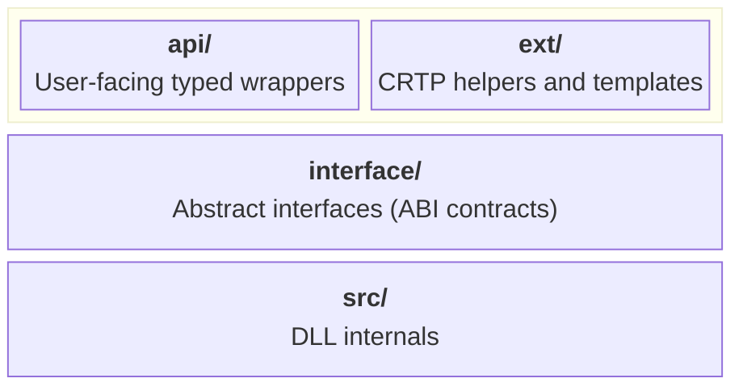
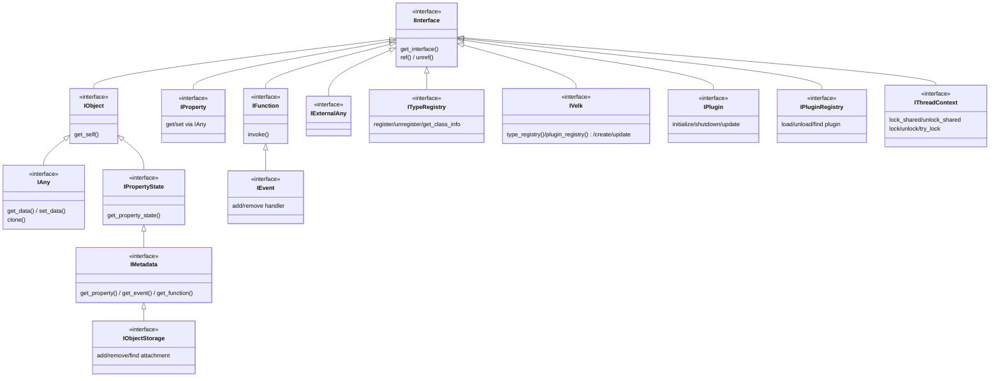
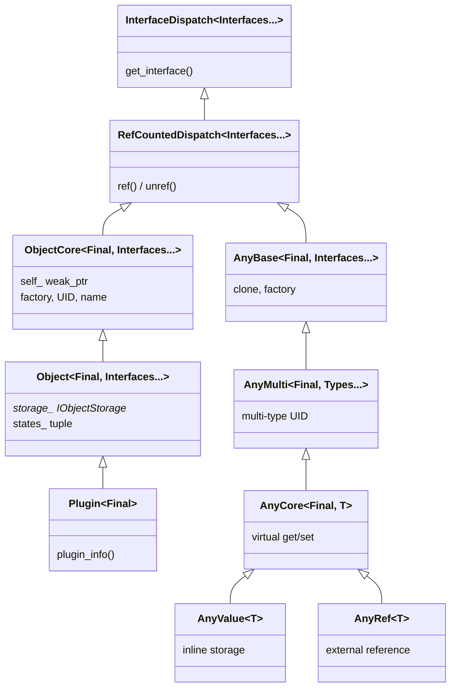

# Architecture

This document describes the general architecture and code division in Velk.

## Contents

- [Layers](#layers)
- [interface/](#interface)
- [ext/](#ext)
- [api/](#api)
- [src/](#src)
- [Type hierarchy across layers](#type-hierarchy-across-layers)
  - [Interface inheritance](#interface-inheritance)
  - [ext/ class hierarchy](#ext-class-hierarchy)
- [ABI stability](#abi-stability)
  - [STL replacement types](#stl-replacement-types)
  - [What makes these ABI-safe](#what-makes-these-abi-safe)
  - [shared_ptr dual mode](#shared_ptr-dual-mode)
  - [STL types in public headers](#stl-types-in-public-headers)
  - [What is NOT replaced](#what-is-not-replaced)
- [Threading model](#threading-model)
  - [Design rationale](#design-rationale)
  - [InvokeType and thread ownership](#invoketype-and-thread-ownership)
  - [What Auto does not cover](#what-auto-does-not-cover)
  - [ThreadContext (opt-in read/write synchronization)](#threadcontext-opt-in-readwrite-synchronization)
  - [Thread safety guarantees](#thread-safety-guarantees)
  - [Platform thread IDs](#platform-thread-ids)
- [Key types](#key-types)

## Layers

The library is organized in four layers:


```mermaid
block
columns 1
  block
    api["<b>api/</b><br>User-facing typed wrappers"]
    ext["<b>ext/</b><br>CRTP helpers and templates"]
  end
  interface["<b>interface/</b><br>Abstract interfaces (ABI contracts)"]
  src["<b>src/</b><br>DLL internals"]
```

```
velk/
  include/               Public headers (available to DLL consumers)
    interface/           Abstract interfaces (pure virtual)
    ext/                 CRTP helpers and template implementations for application-defined objects/types
    api/                 User-facing typed wrappers for API usage
    common.h             Uid, type_uid<T>(), get_name<T>()
    array_view.h         Lightweight constexpr span-like view
    vector.h             Owning resizable array (ABI-stable std::vector replacement)
    string_view.h        Non-owning string reference
    string.h             Owning string with SSO (ABI-stable std::string replacement)
  src/                   Internal runtime implementations (compiled into DLL)
```

## interface/

Abstract interfaces (pure virtual). These define the ABI contracts.

| Header | Description |
|---|---|
| `intf_interface.h` | `IInterface` root with UID-based `get_interface()` and ref-counting; `Interface<T>` CRTP with auto UID |
| `intf_object.h` | `IObject` base with `get_self()` for shared_ptr retrieval |
| `intf_metadata.h` | `MemberDesc`, `IMetadata`, `VELK_INTERFACE` macro |
| `intf_object_storage.h` | `AttachmentQuery`, `IObjectStorage` extends `IMetadata` with attachment support |
| `intf_property.h` | `IProperty` with type-erased get/set and on_changed |
| `intf_event.h` | `IEvent` (inherits `IFunction`) with add/remove handler (immediate or deferred) |
| `intf_function.h` | `FnArgs` argument view, `IFunction` invocable callback with `InvokeType` support, `resolve_invoke_type()` helper |
| `intf_any.h` | `IAny` type-erased value container |
| `intf_external_any.h` | `IExternalAny` for externally-managed data |
| `intf_type_registry.h` | `ITypeRegistry` for type registration and class info lookup |
| `intf_plugin.h` | `PluginInfo`, `PluginDependency`, `PluginConfig`, `IPlugin` interface, version helpers (`make_version`, `version_major/minor/patch`) |
| `intf_plugin_registry.h` | `IPluginRegistry` for loading/unloading plugins by instance or from shared libraries |
| `intf_velk.h` | `UpdateInfo`, `IVelk` for object creation, factory methods, and deferred tasks; delegates type registration to `ITypeRegistry` via `type_registry()` and plugin management to `IPluginRegistry` via `plugin_registry()` |
| `intf_hierarchy.h` | `HierarchyNode`, `HierarchyChange`, `IHierarchy` external tree of `IObject` references with `on_changing`/`on_changed` events; `IHierarchyAware` optional lifecycle callbacks |
| `intf_thread_context.h` | `IThreadContext` opt-in shared reader/writer lock satisfying C++ SharedMutex named requirements |
| `intf_object_factory.h` | `IObjectFactory` for instance creation |
| `types.h` | `ClassInfo`, `Duration`, `ReturnValue`, `interface_cast`, `interface_pointer_cast` |

## ext/

CRTP helpers and template implementations.

| Header | Description |
|---|---|
| `interface_dispatch.h` | `ext::InterfaceDispatch<Interfaces...>` generic `get_interface` dispatching across a pack of interfaces (walks parent interface chain) |
| `refcounted_dispatch.h` | `ext::RefCountedDispatch<Interfaces...>` extends `InterfaceDispatch` with intrusive ref-counting |
| `core_object.h` | `ext::ObjectFactory<T>` singleton factory; `ext::ObjectCore<T, Interfaces...>` CRTP with factory, self-pointer |
| `object.h` | `ext::Object<T, Interfaces...>` adds `IObjectStorage` support with collected metadata and attachments |
| `metadata.h` | `ext::TypeMetadata<T>`, `ext::CollectedMetadata<Interfaces...>` constexpr metadata collection |
| `any.h` | `ext::AnyBase`, `ext::AnyMulti<Types...>`, `ext::AnyCore<T>`, `ext::AnyValue<T>` |
| `event.h` | `ext::LazyEvent` helper for deferred event creation |
| `plugin.h` | `ext::Plugin<T>` CRTP base for plugins; `VELK_PLUGIN_UID/NAME/VERSION/DEPS` macros; `VELK_PLUGIN` export macro |

## api/

User-facing typed wrappers.

| Header | Description |
|---|---|
| `velk.h` | `instance()` singleton access |
| `property.h` | `ConstProperty<T>` read-only and `Property<T>` typed property wrappers |
| `any.h` | `Any<T>` typed any wrapper |
| `callback.h` | `Callback` creator with lambda support (constructs new IFunction instances) |
| `function.h` | `Function` wrapper around existing IFunction, variadic `invoke_function` overloads |
| `event.h` | `Event` wrapper around existing IEvent |
| `function_context.h` | `FunctionContext` view for multi-arg access with count validation |
| `object.h` | `Object` convenience wrapper with null-safe metadata, state, and attachment access |
| `hierarchy.h` | `Hierarchy` wrapper inheriting `Object` for `IHierarchy` operations; `Node` wrapper for `HierarchyNode` snapshots |
| `thread_context.h` | `ThreadContext` wrapper with `read_lock()`/`write_lock()` RAII helpers; `create_thread_context()` factory |
| `attachment.h` | `find_or_create_attachment<T>()` free function helpers |

## src/

Internal runtime implementations (compiled into the DLL).

| File | Description |
|---|---|
| `velk_instance.cpp/h` | `VelkInstance` implementing `IVelk`, `ITypeRegistry`, and `IPluginRegistry` |
| `library_handle.h` | Platform-abstracted shared library loading (`LoadLibrary`/`dlopen`) |
| `platform.h` | Platform-specific OS includes (`windows.h`, `dlfcn.h`, `pthread.h`) |
| `object_storage.cpp/h` | `ObjectStorage` implementing `IObjectStorage` with lazy member creation and attachments |
| `property.cpp/h` | `ClassId::Property` implementation |
| `function.cpp/h` | `ClassId::Function` implementing `IFunction` |
| `event.cpp/h` | `ClassId::Event` implementing `IEvent` (inherits `IFunction`) |
| `velk.cpp` | DLL entry point, exports `instance()` |

## Type hierarchy across layers

### Interface inheritance


```mermaid
classDiagram
    direction TB

    class IInterface {
        <<interface>>
        get_interface()
        ref() / unref()
    }

    class IObject {
        <<interface>>
        get_self()
    }
    class IAny {
        <<interface>>
        get_data() / set_data()
        clone()
    }

    class IPropertyState {
        <<interface>>
        get_property_state()
    }
    class IMetadata {
        <<interface>>
        get_property() / get_event() / get_function()
    }
    class IObjectStorage {
        <<interface>>
        add/remove/find attachment
    }
    class IProperty {
        <<interface>>
        get/set via IAny
    }
    class IFunction {
        <<interface>>
        invoke()
    }
    class IEvent {
        <<interface>>
        add/remove handler
    }

    class IExternalAny {
        <<interface>>
    }
    class ITypeRegistry {
        <<interface>>
        register/unregister/get_class_info
    }
    class IVelk {
        <<interface>>
        type_registry()/plugin_registry()/create/update
    }
    class IPlugin {
        <<interface>>
        initialize/shutdown/update
    }
    class IPluginRegistry {
        <<interface>>
        load/unload/find plugin
    }
    class IThreadContext {
        <<interface>>
        lock_shared/unlock_shared
        lock/unlock/try_lock
    }

    IInterface <|-- IObject
    IObject <|-- IAny
    IObject <|-- IPropertyState
    IPropertyState <|-- IMetadata
    IMetadata <|-- IObjectStorage

    IInterface <|-- IProperty
    IInterface <|-- IFunction
    IFunction <|-- IEvent

    IInterface <|-- IPlugin
    IInterface <|-- IExternalAny
    IInterface <|-- ITypeRegistry
    IInterface <|-- IPluginRegistry
    IInterface <|-- IVelk
    IInterface <|-- IThreadContext
```

### ext/ class hierarchy


```mermaid
classDiagram
    direction TB

    class InterfaceDispatch~Interfaces...~ {
        get_interface()
    }
    class RefCountedDispatch~Interfaces...~ {
        ref() / unref()
    }

    class ObjectCore~Final, Interfaces...~ {
        self_ weak_ptr
        factory, UID, name
    }
    class Object~Final, Interfaces...~ {
        storage_ IObjectStorage*
        states_ tuple
    }
    class Plugin~Final~ {
        plugin_info()
    }

    class AnyBase~Final, Interfaces...~ {
        clone, factory
    }
    class AnyMulti~Final, Types...~ {
        multi-type UID
    }
    class AnyCore~Final, T~ {
        virtual get/set
    }
    class AnyValue~T~ {
        inline storage
    }
    class AnyRef~T~ {
        external reference
    }

    InterfaceDispatch <|-- RefCountedDispatch

    RefCountedDispatch <|-- ObjectCore
    ObjectCore <|-- Object
    Object <|-- Plugin

    RefCountedDispatch <|-- AnyBase
    AnyBase <|-- AnyMulti
    AnyMulti <|-- AnyCore
    AnyCore <|-- AnyValue
    AnyCore <|-- AnyRef
```

Each concept in Velk has types at up to three layers. The naming follows a consistent pattern:

- **`I` prefix** — pure virtual interface (ABI contract)
- **`Core` suffix** — minimal CRTP base (extend for custom behavior)
- **`Value` / `Simple` / no suffix** — ready-to-use concrete or full-featured base
- **`T` suffix** — typed api wrapper that users hold by value

| Concept | interface/ | ext/ | api/ |
|---------|-----------|------|------|
| **Any** | `IAny` | `ext::AnyBase` | `Any<T>` |
| | | `ext::AnyMulti<Types...>` | |
| | | `ext::AnyCore<Final, T>` | |
| | | `ext::AnyValue<T>` | |
| **Object** | `IObject`, `IObjectStorage` | `ext::ObjectCore<Final, Intf...>` | `Object`, `Hierarchy`, `Node` |
| | | `ext::Object<Final, Intf...>` | |
| **Property** | `IProperty` | — | `ConstProperty<T>`, `Property<T>` |
| **Function** | `IFunction` | — | `Function` (wrapper), `Callback` (creator) |
| **Event** | `IEvent` | `ext::LazyEvent` | `Event` (wrapper) |
| **Plugin** | `IPlugin`, `IPluginRegistry` | `ext::Plugin<Final>` | — |

**Any hierarchy** (ext/) — three levels for different extension points:

| Class | Role | When to use |
|-------|------|-------------|
| `ext::AnyBase<Final, Intf...>` | Internal base with ref-counting, clone, factory | Rarely used directly |
| `ext::AnyMulti<Final, Types...>` | Multi-type compatible any | When an any must expose multiple type UIDs |
| `ext::AnyCore<Final, T, Intf...>` | Single-type with virtual get/set | Extend for custom storage (external data, shared state) |
| `ext::AnyValue<T>` | Inline storage, ready to use | Default choice for simple typed values |

**Object hierarchy** (ext/) — two levels:

| Class | Role | When to use |
|-------|------|-------------|
| `ext::ObjectCore<Final, Intf...>` | Minimal base (no metadata) | Internal implementations (`ClassId::Property`, `ClassId::Function`, `VelkInstance`) |
| `ext::Object<Final, Intf...>` | Full base with metadata and attachments | User-defined types with `VELK_INTERFACE` |
| `ext::Plugin<Final>` | Plugin base with static metadata | Plugin implementations |

## ABI stability

Velk is distributed as a shared library (DLL/.so). Consumers compile against the public headers and link the DLL at runtime. This means every type that crosses the DLL boundary, function parameters, return values, struct members in public interfaces, must have an **identical memory layout** regardless of which compiler, standard library, or build flags the consumer uses.

The C++ Standard Library does not guarantee ABI stability. `std::string_view`, `std::shared_ptr`, `std::span`, and other vocabulary types vary in size, alignment, and internal layout across compiler vendors and even between major versions of the same vendor. Passing an `std::shared_ptr` created by MSVC 2019 to code compiled with MSVC 2022 (or Clang, or a different STL implementation) is undefined behavior if the layouts differ.

Velk's solution to this is to provide its own vocabulary types with fixed, documented layouts. These types are intentionally minimal, they implement only what the library needs, avoiding the full generality (and corresponding complexity) of their STL counterparts.

### STL replacement types

| Velk type | STL equivalent | Layout | Purpose |
|---|---|---|---|
| `string_view` | `std::string_view` | `{const char*, size_t}` = 16 bytes | Non-owning string reference in interface signatures and metadata |
| `string` | `std::string` | `union{heap, local}` = 24 bytes | Owning string with SSO (up to 22 chars inline, no allocation) |
| `array_view<T>` | `std::span<const T>` | `{const T*, size_t}` = 16 bytes | Constexpr view over contiguous data (metadata arrays, member lists) |
| `vector<T>` | `std::vector<T>` | `{T*, size_t, size_t}` = 24 bytes | Owning resizable array using malloc/free with placement new |
| `shared_ptr<T>` | `std::shared_ptr<T>` | `{T*, control_block*}` = 16 bytes | Shared ownership across DLL boundary with weak reference support |
| `weak_ptr<T>` | `std::weak_ptr<T>` | `{T*, control_block*}` = 16 bytes | Non-owning observer that can attempt to lock a `shared_ptr` |
| `refcnt_ptr<T>` | `std::shared_ptr<T>` (intrusive) | `{T*}` = 8 bytes | Lightweight intrusive refcounted pointer (no control block) |
| `Uid` | — | `{uint64_t, uint64_t}` = 16 bytes | 128-bit type/interface identifier (constexpr FNV-1a or user-specified) |

### What makes these ABI-safe

1. **POD or near-POD layout.** Each type is a simple struct with primitive members (`T*`, `size_t`, `uint64_t`). No virtual functions, no inheritance, no compiler-generated padding surprises. The layout is the same on any C++17 compiler targeting the same platform.

2. **No STL in the interface.** Public interface methods never accept or return STL types. A consumer can use any standard library implementation internally. The DLL boundary only sees Velk types.

3. **Ref-counting lives in the object.** `IInterface` provides `ref()`/`unref()` virtuals. The `shared_ptr` calls these for IInterface-derived types, so the ref-counting logic is always in the DLL. Never duplicated or inlined differently across compilation units.

4. **Control block is DLL-allocated.** The `control_block` is created inside the DLL by `create_control_block()`. Both the DLL and the consumer see the same 24-byte struct, but the DLL owns allocation and deallocation.

### shared_ptr dual mode

Velk's `shared_ptr<T>` operates in two modes depending on `T`:

- **IInterface-derived types**: Intrusive. `shared_ptr` calls `ref()`/`unref()` on the object and only uses the `control_block` for weak reference support. Multiple independent `shared_ptr` instances can be created from raw pointers to the same object. They all share the object's intrusive ref count.

- **Non-IInterface types** (e.g. `shared_ptr<int>`): External. A `control_block` is heap-allocated with a type-erased destructor, similar to `std::shared_ptr`. This mode is used internally but never crosses the DLL boundary.

The mode is selected at compile time via `std::is_convertible_v<T*, IInterface*>`.

### STL types in public headers

The public headers (`interface/`, `ext/`, `api/`) use several STL types. These are safe because they either never cross the DLL boundary or are used in contexts where both sides compile the same header.

| Type | Where | Why it's safe |
|---|---|---|
| `std::array` | Metadata arrays in `VELK_INTERFACE` and `ext::CollectedMetadata` | Compile-time only. Converted to `array_view<MemberDesc>` before reaching `ClassInfo` or `ObjectStorage`. The `std::array` itself never crosses the DLL boundary. |
| `std::tuple` | `ext::Object::states_` stores per-interface `State` structs | Template instantiated in consumer code. Both the object and its accessors compile from the same headers, so the layout is identical. Never passed to the DLL as a tuple. Individual states are accessed via `array_view` or raw pointers (`get_property_state`). |
| `std::atomic` | `control_block` ref counts, `ObjectData` flags | Layout is platform-defined (same size as the underlying integer). The control block is allocated inside the DLL and accessed through exported functions, so both sides agree on the layout. |

The public headers also make heavy use of STL type traits (`std::is_base_of_v`, `std::enable_if_t`, `std::is_trivially_copyable_v`, `std::index_sequence`, etc.) for SFINAE, overload resolution, and compile-time branching. These have no runtime layout impact.

### What is NOT replaced

`std::unique_ptr`, `std::mutex`, and `std::vector` are used in internal DLL implementations (`src/`) where they do not cross the boundary. `velk::string` and `velk::vector<T>` are available as ABI-stable replacements for `std::string` and `std::vector<T>` in public interface signatures. Internal DLL code may still use the STL variants when values do not cross the boundary.

## Threading model

Velk objects are not internally synchronized. Properties, events, and functions have no mutexes. Instead, thread safety is handled through **invocation modes** that route work based on which thread is calling.

### Design rationale

Properties, events, and functions use three invocation modes to control when work executes:

- **Auto** (default): compares the calling thread's ID against the object's owner thread ID. Same thread executes immediately; different thread defers to `update()`. One thread ID comparison per call.
- **Immediate**: executes synchronously, zero overhead. The caller takes responsibility for thread safety.
- **Deferred**: clones arguments and queues the work for the next `instance().update()` call, regardless of which thread is calling. Useful for batching changes.

Immediate and Deferred map directly to same-thread and cross-thread access: a write from the owning thread can safely execute in place, while a write from another thread should be queued to avoid data races. Auto makes this routing automatic so callers don't need to know which thread they're on.

This fits a pay-for-what-you-use model. Auto is the safe default with minimal overhead. Single-threaded apps can switch to Immediate to eliminate even the thread ID comparison. Multi-threaded apps that want explicit control over batching can use Deferred directly.

### InvokeType and thread ownership

Every object stores the thread ID of its creator in `ObjectData::owner_thread_id`. This is set once at construction and currently cannot be changed (thread ownership transfer is future work).

When a method like `set_value`, `invoke`, or `add_handler` receives `Auto`, the implementation calls `resolve_invoke_type()`:

```cpp
inline InvokeType resolve_invoke_type(InvokeType type, uint32_t owner_thread_id)
{
    if (type != Auto) return type;
    return current_thread_id() == owner_thread_id ? Immediate : Deferred;
}
```

This happens at the top of each DLL-side implementation (`ClassId::Property`, `ClassId::Function`, `ClassId::Event`). `ClassId::Future` is the exception: it resolves `Auto` when each continuation fires, so a result set on a worker thread (for example by a task pool) routes the continuation to the owner thread's `update()`. API wrappers and interfaces pass `Auto` through unchanged; resolution always happens inside the DLL where the object's thread ID is accessible.

The `Auto = 0` enum value means that zero-initialized or default-constructed `InvokeType` fields are Auto, making it the natural default everywhere.

### What Auto does not cover

Auto mode solves **accidental cross-thread writes**: a background thread calling `set_value` without specifying `Deferred` will have its write safely queued instead of corrupting data. But it does not provide **read/write synchronization**.

If a render thread reads property state while the UI thread writes (both on the owning thread's `update()` cycle), Auto mode does not help because both threads may be accessing data simultaneously. Velk provides `IThreadContext` as an opt-in solution for this case (see below).

### ThreadContext (opt-in read/write synchronization)

`IThreadContext` is an opt-in shared reader/writer lock that satisfies the C++ SharedMutex named requirements. This means `std::shared_lock<IThreadContext>` and `std::unique_lock<IThreadContext>` work directly.

**Why manual, not automatic:** Per-property mutexes would add overhead to every object whether it needs thread safety or not, and would make batch operations (reading ten properties in one frame) acquire and release ten separate locks. A single shared lock per object group is both cheaper and more correct: readers hold a shared lock for the duration of their batch, writers hold an exclusive lock for theirs, and objects that never leave the owning thread pay zero cost.

**Usage:**

```cpp
auto ctx = create_thread_context();

// Attach to a hierarchy so all objects in the tree share one lock
auto h = create_hierarchy();
h.set_thread_context(ctx);

// Reader thread
{
    auto lock = ctx.read_lock();   // std::shared_lock
    auto val = prop.get_value();
}

// Writer thread
{
    auto lock = ctx.write_lock();  // std::unique_lock
    prop.set_value(42, Immediate);
}
```

**Hierarchy attachment:** `Hierarchy::set_thread_context()` stores the context as an attachment on the hierarchy object. `Hierarchy::thread_context()` retrieves it. This lets an entire object tree share a single lock without each object needing to know about threading.

### Thread safety guarantees

| Component | Thread safety |
|---|---|
| `instance().type_registry()` | Thread-safe (concurrent reads, exclusive writes) |
| `instance().plugin_registry()` | Thread-safe (concurrent reads, exclusive writes) |
| `instance().queue_deferred_tasks()` | Thread-safe (mutex-protected queue) |
| `instance().create_future()` | Thread-safe (safe to resolve, wait, and add continuations from any thread) |
| `ITaskPool` (threaded and manual) | Thread-safe (`submit`, `post` and `pending` from any thread; `IManualTaskPool::drain` runs tasks on the calling thread) |
| `IThreadContext` | Thread-safe (wraps `std::shared_mutex`; satisfies SharedMutex named requirements) |
| Properties, events, functions | Not internally synchronized. `InvokeMode::Auto` routes cross-thread writes through the deferred queue. Opt-in `IThreadContext` available for read/write synchronization. |

### Platform thread IDs

Thread identification uses OS-level thread IDs (`GetCurrentThreadId()` on Windows, `pthread_self()` on POSIX) stored as `uint32_t`. These are plain integers that are safe to compare across DLL boundaries, unlike `std::thread::id` which is CRT-dependent and may differ between compilation units linked against different standard libraries.

The `current_thread_id()` utility in `thread.h` is a thin inline wrapper. On Windows it uses a forward-declared `GetCurrentThreadId()` to avoid pulling in `windows.h`.

## Key types

| Type | Role |
|---|---|
| `string_view` | ABI-stable non-owning string reference (`{const char*, size_t}`); replaces `std::string_view` at DLL boundaries |
| `string` | ABI-stable owning string with SSO (`union{heap, local}` = 24 bytes); up to 22 chars stored inline; implicitly converts to `string_view` |
| `array_view<T>` | ABI-stable constexpr span-like view over contiguous const data (`{const T*, size_t}`); replaces `std::span` |
| `vector<T>` | ABI-stable owning resizable array (`{T*, size_t, size_t}` = 24 bytes); uses malloc/free with placement new; implicitly converts to `array_view<T>` |
| `shared_ptr<T>` | ABI-stable shared ownership pointer (`{T*, control_block*}`); intrusive for IInterface types, external for others |
| `weak_ptr<T>` | ABI-stable non-owning observer (`{T*, control_block*}`); locks to a `shared_ptr` if the object is still alive |
| `refcnt_ptr<T>` | Lightweight intrusive refcounted pointer (`{T*}`); calls `ref()`/`unref()` directly, no control block |
| `control_block` | Shared ref-count block for `shared_ptr`/`weak_ptr` (`{atomic strong, atomic weak, destroy, ptr}` = 24 bytes) |
| `Uid` | 128-bit identifier for types and interfaces; constexpr FNV-1a from type names or user-specified |
| `Interface<T, Base>` | CRTP base for interfaces; provides `UID`, `INFO`, smart pointer aliases, `ParentInterface` typedef for dispatch chain walking |
| `ext::InterfaceDispatch<Interfaces...>` | Implements `get_interface` dispatching across a pack of interfaces and their parent interface chains |
| `ext::RefCountedDispatch<Interfaces...>` | Extends `InterfaceDispatch` with atomic ref-counting (`ref`/`unref`) |
| `ext::ObjectCore<T, Interfaces...>` | Minimal CRTP base for objects (without metadata); auto UID/name, factory, self-pointer |
| `ext::Object<T, Interfaces...>` | Full CRTP base; extends `ObjectCore` with metadata from all interfaces |
| `InvokeType` | Enum (`Auto`, `Immediate`, `Deferred`) controlling execution timing. `Auto` (default) checks thread ownership: same thread = `Immediate`, different thread = `Deferred` |
| `FnArgs` | Non-owning view of function arguments (`{const IAny* const* data, size_t count}`) with bounds-checked `operator[]` |
| `FunctionContext` | Lightweight view over `FnArgs` with count validation and typed `arg<T>(i)` access |
| `DeferredTask` | Nested struct in `IVelk` pairing an `IFunction::ConstPtr` with a cloned `std::vector<IAny::Ptr>` of args |
| `ConstProperty<T>` | Read-only typed property with `get_value()` and change events (returned by `RPROP` accessors) |
| `Property<T>` | Typed property with `get_value()`/`set_value()` and change events |
| `Any<T>` | Typed view over `IAny`; `IAny::clone()` creates a deep copy via the type's factory |
| `Function` | Lightweight wrapper around an existing `IFunction` pointer (returned by `FN`/`FN_RAW` accessors) |
| `Event` | Lightweight wrapper around an existing `IEvent` pointer (returned by `EVT` accessors) |
| `Callback` | Creates and owns an `IFunction` from `ReturnValue(FnArgs)` callbacks or typed lambdas |
| `ext::LazyEvent` | Helper that lazily creates an `IEvent` on first access via implicit conversion |
| `ext::Plugin<T>` | CRTP base for plugin implementations; collects static metadata (name, version, dependencies) via SFINAE |
| `PluginInfo` | Static plugin descriptor: factory, name, version, dependencies; accessible without an instance via `Plugin<T>::plugin_info()` |
| `PluginConfig` | Per-plugin configuration set during `initialize`: `retainTypesOnUnload`, `enableUpdate` |
| `PluginDependency` | Plugin dependency entry: UID and optional minimum version |
| `Duration` | Type-safe microsecond duration (`{int64_t us}`) used in `UpdateInfo` and `IVelk::update()` |
| `UpdateInfo` | Time information passed to plugin `update()`: `time`, `elapsed`, and `dt` (all `Duration`) |
| `IThreadContext` | Opt-in shared reader/writer lock interface; satisfies C++ SharedMutex named requirements (`lock_shared`/`unlock_shared`/`lock`/`unlock`/`try_lock_shared`/`try_lock`) |
| `ThreadContext` | API wrapper around `IThreadContext::Ptr`; provides `read_lock()` (shared) and `write_lock()` (exclusive) returning RAII lock guards |
| `MemberDesc` | Describes a property, event, or function member |
| `ClassInfo` | UID, name, `array_view<InterfaceInfo>` of implemented interfaces, and `array_view<MemberDesc>` for a registered class |
