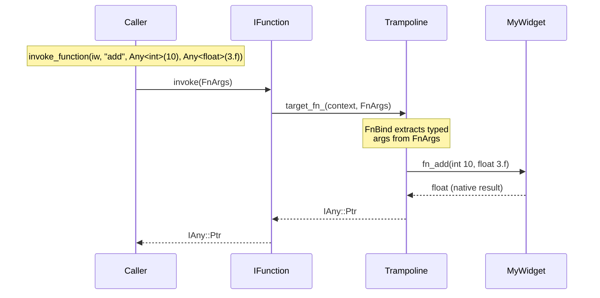
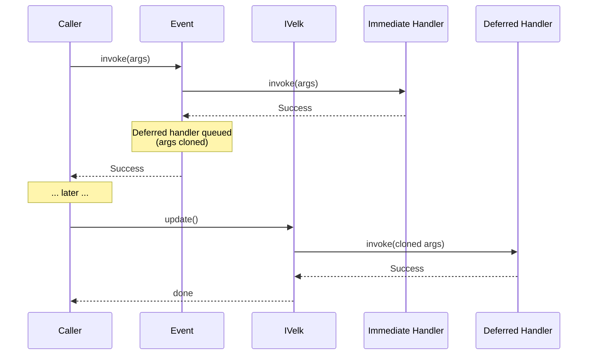
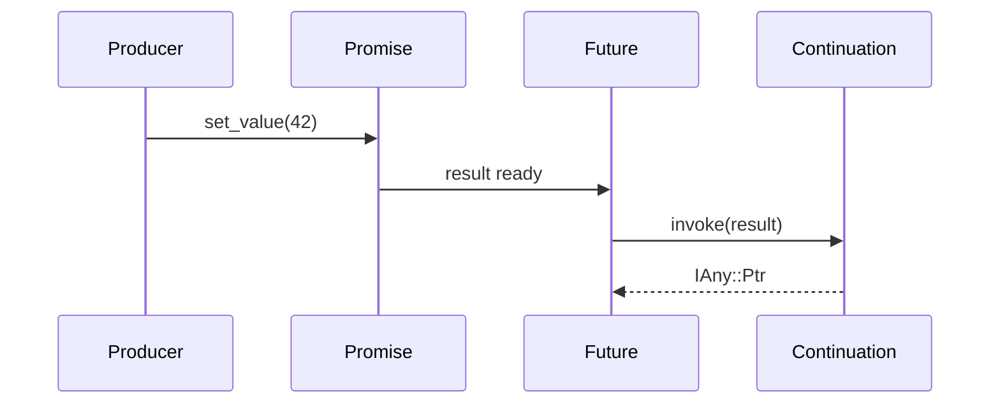

# Guide

This guide covers topics beyond the basics shown in the [README](../README.md). Start here after reading the quick start.

## Contents

- [Declaring interfaces](#declaring-interfaces)
  - [VELK_INTERFACE syntax](#velk_interface-syntax)
  - [Practical example](#practical-example)
  - [Array property members](#array-property-members)
  - [Function member variants](#function-member-variants)
  - [Argument metadata](#argument-metadata)
- [Class UIDs](#class-uids)
- [Functions and events](#functions-and-events)
  - [Virtual function dispatch](#virtual-function-dispatch)
  - [Function arguments](#function-arguments)
  - [Typed lambda parameters](#typed-lambda-parameters)
  - [Deferred invocation](#deferred-invocation)
    - [Defer at the call site](#defer-at-the-call-site)
    - [Deferred event handlers](#deferred-event-handlers)
  - [Futures and promises](#futures-and-promises)
    - [Basic usage](#basic-usage)
    - [Continuations](#continuations)
    - [Then chaining](#then-chaining)
    - [Type transforms](#type-transforms)
    - [Thread safety](#thread-safety)
- [Properties](#properties)
  - [Change notifications](#change-notifications)
  - [Custom Any types](#custom-any-types)
  - [Direct state access](#direct-state-access)
    - [read_state / write_state](#read_state--write_state)
    - [Raw state pointer](#raw-state-pointer)
  - [Deferred property assignment](#deferred-property-assignment)
    - [Deferred write_state](#deferred-write_state)

## Declaring interfaces

Use `VELK_INTERFACE` inside an `Interface<T>` subclass to declare properties, events, and functions. The macro generates a static constexpr metadata array, typed accessor methods, and (for `FN` members) pure virtual methods with trampolines.

### VELK_INTERFACE syntax

```cpp
VELK_INTERFACE(
    (PROP, Type, Name, Default),              // Property<Type> Name() const
    (RPROP, Type, Name, Default),             // ConstProperty<Type> Name() const (read-only)
    (ARR, Type, Name),                        // ArrayProperty<Type> Name() const
    (ARR, Type, Name, v1, v2, v3),            // ArrayProperty<Type> Name() const (default {v1,v2,v3})
    (RARR, Type, Name, v1, v2),              // ConstArrayProperty<Type> Name() const (read-only)
    (EVT, Name),                              // Event Name() const
    (FN, RetType, Name),                      // virtual RetType fn_Name()          (zero-arg)
    (FN, RetType, Name, (T1, a1), (T2, a2)),  // virtual RetType fn_Name(T1 a1, T2 a2) (typed)
    (FN_RAW, Name)                            // virtual fn_Name(FnArgs)   (raw untyped)
)
```

Each entry produces a `MemberDesc` in a `static constexpr std::array metadata` and a typed accessor method. Up to 32 members per interface. Up to 8 typed parameters per function. Members track which interface declared them via `InterfaceInfo`. Array properties use `MemberKind::ArrayProperty` and are backed by `ArrayPropertyImpl` at runtime.

### Practical example

```cpp
class IMyWidget : public Interface<IMyWidget>
{
public:
    VELK_INTERFACE(
        (PROP, float, width, 0.f),
        (ARR, float, weights, 1.f, 2.f, 3.f),     // array with defaults
        (RARR, int32_t, tags),                      // read-only array, empty default
        (EVT, on_clicked),
        (FN, void, reset),                          // zero-arg, void return
        (FN, float, add, (int, x), (float, y))     // typed args, typed return
    )
};

class ISerializable : public Interface<ISerializable>
{
public:
    VELK_INTERFACE(
        (PROP, std::string, name, ""),
        (FN_RAW, serialize)                 // raw FnArgs
    )
};

class MyWidget : public ext::Object<MyWidget, IMyWidget, ISerializable>
{
    void fn_reset() override {
        // void return, trampoline returns nullptr to IFunction::invoke()
    }

    float fn_add(int x, float y) override {
        // x and y are extracted from FnArgs automatically
        // return value is wrapped into IAny::Ptr by the trampoline
        return x + y;
    }

    IAny::Ptr fn_serialize(FnArgs args) override {
        // manual arg unpacking via FunctionContext or Any<const T>
        return nullptr;
    }
};
```

Invocation works the same for all variants, callers always go through `IFunction::invoke()`:

```cpp
auto widget = instance().create<IObject>(MyWidget::class_id());
if (auto* iw = interface_cast<IMyWidget>(widget)) {
    // Scalar property
    iw->width().set_value(100.f);

    // Array property: element-level access
    iw->weights().push_back(4.f);
    float w = iw->weights().at(0);      // 1.f
    iw->weights().set_at(0, 10.f);
    iw->weights().erase_at(2);

    // Read-only array property
    size_t n = iw->tags().size();
    // iw->tags().push_back(42);         // won't compile: ConstArrayProperty

    // Functions
    invoke_function(iw->reset());                            // zero-arg
    invoke_function(iw, "add", Any<int>(10), Any<float>(3.14f)); // typed
}
if (auto* is = interface_cast<ISerializable>(widget)) {
    invoke_function(is, "serialize");                         // FN_RAW
}
```

### Array property members

`ARR` and `RARR` declare array properties backed by `velk::vector<T>` in the State struct. They provide element-level access (get, set, push, erase) without copying the full vector.

| Syntax | Accessor return type | Mutability |
|--------|---------------------|------------|
| `(ARR, float, items)` | `ArrayProperty<float>` | Read-write |
| `(ARR, float, items, 1.f, 2.f)` | `ArrayProperty<float>` | Read-write, default `{1.f, 2.f}` |
| `(RARR, int, ids)` | `ConstArrayProperty<int>` | Read-only |
| `(RARR, int, ids, 10, 20)` | `ConstArrayProperty<int>` | Read-only, default `{10, 20}` |

Default values are variadic: any arguments after the name become the initializer list for the vector.

#### API wrappers

`ConstArrayProperty<T>` (returned by `RARR`) provides read-only access:

```cpp
size_t size() const;
bool empty() const;
T at(size_t index) const;           // single element, no full vector copy
vector<T> get_value() const;        // full copy when needed
```

`ArrayProperty<T>` (returned by `ARR`) adds mutation:

```cpp
ReturnValue set_at(size_t index, const T& value);
ReturnValue push_back(const T& value);
ReturnValue erase_at(size_t index);
void clear();
ReturnValue set_value(const vector<T>& value, InvokeType type = Immediate);
```

#### ArrayAny\<T\>

`ArrayAny<T>` (in `api/any.h`) is a typed wrapper for `IArrayAny`, similar to how `Any<T>` wraps `IAny`. It can be value-constructed (owning) or wrap an existing `IAny::Ptr`/`IAny::ConstPtr`. Use `const T` for read-only access:

```cpp
// Owning: default-constructed empty array
ArrayAny<float> empty;

// Owning: from initializer list
ArrayAny<float> arr({3.14f, 2.71f});
float val = arr.at(0);

// Owning: from array_view
float data[] = {1.f, 2.f, 3.f};
ArrayAny<float> fromView(array_view<float>(data, 3));

// Wrapping an existing IAny::Ptr
ArrayAny<float> wrapped(some_any_ptr);
wrapped.push_back(42.f);

// Read-only: constructed from IAny::ConstPtr, mutation methods are disabled
ArrayAny<const float> readonly_arr(some_const_any_ptr);
float v = readonly_arr.at(0);         // OK
// readonly_arr.push_back(1.f);       // compile error
```

#### Architecture

Array properties use `IArrayAny` for element-level operations. When the macro generates `ArrBind<State, &State::member>`, it produces a `PropertyKind` whose `createRef` returns an `ArrayAnyRef<T>` (in `ext/any.h`). This ref implements both `IAny` (whole-vector get/set) and `IArrayAny` (element ops). `ArrayPropertyImpl` delegates element operations to `interface_cast<IArrayAny>(data_)` on its backing Any, and wraps them in `on_changed` notifications.

### Function member variants

`FN` and `FN_RAW` are the two tags for function members. `FN` supports zero-arg and typed-arg forms; `FN_RAW` preserves the untyped `FnArgs` signature.

| Syntax | Virtual generated | Arg metadata | Use case |
|--------|------------------|--------------|----------|
| `(FN, void, reset)` | `void fn_reset()` | none | Zero-arg void functions |
| `(FN, int, add, (int, x), (float, y))` | `int fn_add(int x, float y)` | `FnArgDesc` per param | Typed args with return value |
| `(FN_RAW, process)` | `IAny::Ptr fn_process(FnArgs)` | none | Raw untyped args |

All three variants generate:
1. A pure virtual method (signature depends on variant)
2. A `static constexpr FunctionKind` with a trampoline (via `detail::FnBind` or `detail::FnRawBind`) that routes `IFunction::invoke()` to the virtual
3. A `MemberDesc` with the trampoline pointer in the metadata array
4. An accessor `Function Name() const`

For `FN` members, `RetType` specifies the native C++ return type of the virtual method. The trampoline wraps the result into `IAny::Ptr` automatically: `void` returns `nullptr`, other types are wrapped via `Any<R>::clone()`. `FN_RAW` always returns `IAny::Ptr`.

For typed-arg functions, the trampoline automatically extracts each argument from `FnArgs` using `IAny::get_data()` with type deduction from the member function pointer. If fewer arguments are provided than expected, the trampoline returns `nullptr`. Extra arguments are ignored.

### Argument metadata

Typed-arg functions store a `static constexpr FnArgDesc[]` array alongside the trampoline in `FunctionKind`:

```cpp
struct FnArgDesc {
    std::string_view name;   // parameter name (e.g. "x")
    Uid typeUid;             // type_uid<T>() for the parameter type
};

struct FunctionKind {
    FnTrampoline trampoline;
    array_view<FnArgDesc> args;  // empty for zero-arg and FN_RAW
};
```

Access via `MemberDesc::functionKind()->args`:

```cpp
if (auto* info = instance().type_registry().get_class_info(MyWidget::class_id())) {
    for (auto& m : info->members) {
        if (auto* fk = m.functionKind(); fk && !fk->args.empty()) {
            for (auto& arg : fk->args) {
                // arg.name, arg.typeUid
            }
        }
    }
}
```

For the full hand-written equivalent of what `VELK_INTERFACE` generates, see [Advanced topics](advanced.md).

## Class UIDs

Every class that inherits from `ObjectCore` or `Object` has a class UID returned by `class_id()` (compile-time) or `get_class_uid()` (virtual, on IObject). By default this is auto-generated from the class name via constexpr FNV-1a hashing. You can override it with a stable, user-specified UID using the `VELK_CLASS_UID` macro:

```cpp
class MyWidget : public ext::Object<MyWidget, IMyWidget>
{
    VELK_CLASS_UID("a0b1c2d3-e4f5-6789-abcd-ef0123456789");
    // or static constexpr ::velk::Uid class_uid{"a0b1c2d3-e4f5-6789-abcd-ef0123456789"}

    void fn_reset() override { /* ... */ }
};
```

The UID string is validated at compile time; a malformed or wrong-length string produces a compile error.

User-specified UIDs are useful when you want to:

- **Export stable UIDs** in public headers without exposing internal class names.
- **Create instances by well-known UID** across DLL boundaries, where class names may differ.
- **Maintain ABI stability**, auto-generated UIDs change if the class is renamed or moved to a different namespace.

For example, the built-in `Property`, `Function` and `Future` objects use this mechanism. Their UIDs are defined in `ClassId` namespace in `types.h`:

```cpp
namespace ClassId {
inline constexpr Uid Property{"a66badbf-c750-4580-b035-b5446806d67e"};
inline constexpr Uid Function{"d3c150cc-0b2b-4237-93c5-5a16e9619be8"};
inline constexpr Uid Future{"371dfa91-1cf7-441e-b688-20d7e0114745"};
}
```

## Functions and events

Functions are type-erased callables declared in interfaces via `FN` or `FN_RAW`. Events are multicast delegates declared via `EVT`. Both support immediate and deferred invocation.

### Virtual function dispatch

`VELK_INTERFACE` supports three function forms. `(FN, RetType, Name)` generates a zero-arg virtual `RetType fn_Name()`. `(FN, RetType, Name, (T1, a1), ...)` generates a typed virtual `RetType fn_Name(T1 a1, ...)` with automatic argument extraction from `FnArgs` and return value wrapping. `(FN_RAW, Name)` generates `fn_Name(FnArgs)` for manual argument handling.



```cpp
class IMyWidget : public Interface<IMyWidget>
{
public:
    VELK_INTERFACE(
        (PROP, float, width, 0.f),
        (FN, void, reset),                       // virtual void fn_reset()
        (FN, float, add, (int, x), (float, y)),  // virtual float fn_add(int x, float y)
        (FN_RAW, process)                         // virtual IAny::Ptr fn_process(FnArgs)
    )
};

class MyWidget : public ext::Object<MyWidget, IMyWidget>
{
    void fn_reset() override {
        std::cout << "reset!" << std::endl;
    }

    float fn_add(int x, float y) override {
        std::cout << x + y << std::endl;
        return x + y;           // wrapped into IAny::Ptr by trampoline
    }

    IAny::Ptr fn_process(FnArgs args) override {
        // manual unpacking via FunctionContext or Any<const T>
        return nullptr;
    }
};

// All forms are invoked through IFunction::invoke()
auto widget = instance().create<IObject>(MyWidget::class_id());
if (auto* iw = interface_cast<IMyWidget>(widget)) {
    invoke_function(iw->reset());                               // zero-arg
    invoke_function(iw, "add", Any<int>(10), Any<float>(3.f));  // typed
    invoke_function(iw->process());                             // raw
}
```

Each `fn_Name` is pure virtual, so implementing classes must override it. An explicit `set_invoke_callback()` takes priority over the virtual.

#### Function arguments

For **typed-arg** functions (`(FN, RetType, Name, (T1, a1), ...)`), the trampoline extracts typed values from `FnArgs` automatically, the override receives native C++ parameters. If fewer arguments are provided than expected, the trampoline returns `nullptr`.

For **FN_RAW** functions, arguments arrive as `FnArgs`, a lightweight non-owning view of `{const IAny* const* data, size_t count}`. Access individual arguments with bounds-checked indexing (`args[i]` returns nullptr if out of range) and check the count with `args.count`. Use `FunctionContext` to validate the expected argument count:

```cpp
IAny::Ptr fn_process(FnArgs args) override {
    if (auto ctx = FunctionContext(args, 2)) {
        auto a = ctx.arg<float>(0);
        auto b = ctx.arg<int>(1);
        // ...
    }
    return nullptr;
}
```

Callers use variadic `invoke_function` overloads, values are automatically wrapped in `Any<T>`:

```cpp
invoke_function(iw->reset());                                   // zero-arg
invoke_function(iw, "add", Any<int>(10), Any<float>(3.14f));    // typed args
invoke_function(iw->process(), Any<int>(42));                   // single IAny arg
invoke_function(widget.get(), "process", 1.f, 2u);             // multi-value (auto-wrapped)
```

#### Typed lambda parameters

`Callback` also accepts lambdas with typed parameters. Arguments are automatically extracted from `FnArgs` using `Any<const T>`, so there's no manual unpacking:

```cpp
Callback fn([&](const float& a, const int& b) -> ReturnValue {
    // a and b are extracted from FnArgs automatically
    return ReturnValue::Success;
});

Any<float> x(3.14f);
Any<int> y(42);
const IAny* ptrs[] = {x, y};
fn.invoke(FnArgs{ptrs, 2});
```

Void-returning lambdas are supported, `Callback` wraps them to return `nullptr`:

```cpp
Callback fn([&](float value) {
    std::cout << "received: " << value << std::endl;
});
```

Zero-arity lambdas work too:

```cpp
Callback fn([&]() {
    std::cout << "called!" << std::endl;
});
fn.invoke();  // Success
```

The three constructor forms are mutually exclusive via SFINAE:

| Callable type | Constructor |
|---|---|
| `IAny::Ptr(*)(FnArgs)` (raw function pointer) | `Callback(CallbackFn*)` |
| Callable with `(FnArgs) -> ReturnValue` or `(FnArgs) -> IAny::Ptr` | Capturing lambda ctor |
| Callable with typed params (any return) | Typed lambda ctor |

`invoke()` returns `IAny::Ptr`, `nullptr` for void results, or a typed result. Typed-return lambdas have their result automatically wrapped via `Any<R>`. When fewer arguments are provided than the lambda expects, `invoke()` returns `nullptr`. Extra arguments are ignored. If an argument's type doesn't match the lambda parameter type, the parameter receives a default-constructed value.

### Deferred invocation

Functions and event handlers support deferred execution via the `InvokeType` enum (`Immediate` or `Deferred`). Deferred work is queued and executed when `::velk::instance().update()` is called.



#### Defer at the call site

Pass `Deferred` to `invoke()` to queue the entire invocation:

```cpp
auto fn = iw->reset();
invoke_function(fn, args);                                // executes now (default)
invoke_function(fn, args, InvokeType::Deferred);          // queued for update()
```

#### Deferred event handlers

Register a handler as deferred so it is queued each time the event fires, while immediate handlers on the same event still execute synchronously:

```cpp
auto event = iw->on_clicked();
event->add_handler(immediateHandler);                        // fires synchronously
event->add_handler(deferredHandler, InvokeType::Deferred);   // queued for update()

invoke_event(event, args);  // immediateHandler runs now, deferredHandler is queued
instance().update();        // deferredHandler runs here
```

Arguments are cloned when a task is queued, so the original `IAny` does not need to outlive the call. Deferred tasks that themselves produce deferred work will re-queue, and will be handled when `update()` is called the next time.

### Futures and promises

Velk provides `Promise` and `Future<T>` for asynchronous value delivery. A `Promise` is the write side, it resolves a value. A `Future<T>` is the read side, it waits for or reacts to the value. Both are lightweight wrappers around `IFuture` interface backed by `FutureImpl` in the DLL.



#### Basic usage

Create a promise, hand out its future, and resolve it later:

```cpp
#include <api/future.h>

auto promise = make_promise();
auto future = promise.get_future<int>();

// Consumer side
future.wait();                          // blocks until ready
int value = future.get_result().get_value();

// Producer side (possibly from another thread)
promise.set_value(42);                  // resolves the future
```

For void futures (signaling completion without a value):

```cpp
auto promise = make_promise();
auto future = promise.get_future<void>();

promise.complete();                     // resolves without a value
```

Resolving twice returns `NothingToDo` and the first value persists:

```cpp
promise.set_value(1);                   // Success
promise.set_value(2);                   // NothingToDo, first value wins
```

#### Continuations

Attach a callback that fires when the future resolves. If the future is already ready, the continuation fires immediately:

```cpp
auto promise = make_promise();
auto future = promise.get_future<int>();

// FnArgs continuation, receives the result as args[0]
future.then([](FnArgs args) -> ReturnValue {
    if (auto ctx = FunctionContext(args, 1)) {
        std::cout << "got: " << ctx.arg<int>(0).get_value() << std::endl;
    }
    return ReturnValue::Success;
});

// Typed continuation, arguments are auto-extracted
future.then([](int value) {
    std::cout << "got: " << value << std::endl;
});

promise.set_value(42);                  // fires both continuations
```

Deferred continuations are queued for `instance().update()`:

```cpp
future.then([](int value) {
    std::cout << value << std::endl;
}, Deferred);

promise.set_value(42);                  // continuation is queued, not fired
instance().update();                    // continuation fires here
```

#### Then chaining

`.then()` returns a new `Future` that resolves with the continuation's return value. This enables fluent chaining:

```cpp
auto promise = make_promise();

auto result = promise.get_future<int>()
    .then([](int v) -> int { return v * 2; })
    .then([](int v) -> int { return v + 1; });

promise.set_value(5);
// result is Future<int>, resolves to 11: (5 * 2) + 1
```

Void-returning continuations produce `Future<void>`:

```cpp
auto done = promise.get_future<int>()
    .then([](int v) { std::cout << v << std::endl; });
// done is Future<void>
```

#### Type transforms

Continuations can change the value type between chain steps:

```cpp
auto promise = make_promise();

// int -> float
auto result = promise.get_future<int>()
    .then([](int v) -> float { return v * 1.5f; });

promise.set_value(10);
// result is Future<float>, resolves to 15.f
```

Chaining from a void future is also supported:

```cpp
auto promise = make_promise();
auto result = promise.get_future<void>()
    .then([]() -> int { return 42; });

promise.complete();
// result is Future<int>, resolves to 42
```

#### Thread safety

`Promise` and `Future` are safe to use across threads. `wait()` blocks until the result is available, and multiple threads can wait on the same future:

```cpp
auto promise = make_promise();
auto future = promise.get_future<int>();

std::thread consumer([&] {
    future.wait();                      // blocks until ready
    int v = future.get_result().get_value();
});

promise.set_value(42);                  // unblocks the consumer
consumer.join();
```

Resolution, waiting, and continuation dispatch are all mutex-protected internally. Continuations added after resolution fire immediately (for `Immediate` type) or are queued (for `Deferred` type).

## Properties

Properties are type-erased values with built-in change notification. They are declared in interfaces via `PROP` and created standalone via `create_property<T>`.

### Change notifications

```cpp
auto prop = create_property<float>();
prop.set_value(5.f);

Callback onChange([](FnArgs args) -> ReturnValue {
    if (auto v = Any<const float>(args[0])) {
        std::cout << "new value: " << v.get_value() << std::endl;
    }
    return ReturnValue::Success;
});
prop.add_on_changed(onChange);

prop.set_value(10.f);  // triggers onChange
```

### Custom Any types

Implement `ext::AnyCore` to back a property with external or shared data:

```cpp
class MyDataAny final : public ext::AnyCore<MyDataAny, Data, IExternalAny>
{
public:
    Data& get_value() const override { return globalData_; }
    ReturnValue set_value(const Data& value) override {
        globalData_ = value;
        invoke_event(on_data_changed(), this);
        return ReturnValue::Success;
    }
    IEvent::Ptr on_data_changed() const override { return onChanged_; }
};
```

### Direct state access

Each interface that declares `PROP` members gets a `State` struct with one field per property, initialized with its declared default. `ext::Object` stores these structs inline, and properties read/write directly into them via `ext::AnyRef<T>`.

#### read_state / write_state

`read_state<T>` and `write_state<T>` provide RAII accessors to the state struct. `read_state` returns a read-only view. `write_state` returns a writable view that automatically fires `on_changed` on all instantiated properties of that interface when it goes out of scope. Both return a null-safe handle that converts to `false` if the interface is not implemented by the object or the object pointer is null.

```cpp
auto widget = instance().create<IObject>(MyWidget::class_id());
auto* iw = interface_cast<IMyWidget>(widget);

// Read current state (const access)
if (auto reader = read_state<IMyWidget>(iw)) {
    float w = reader->width;    // 100.f (default)
    float h = reader->height;   // 50.f
}

// Write state with automatic change notification
if (auto writer = write_state<IMyWidget>(iw)) {
    writer->width = 200.f;
    writer->height = 100.f;
}  // ~StateWriter fires on_changed for all instantiated IMyWidget properties
```

The accessors are also available directly on `IMetadata`:

```cpp
auto* meta = interface_cast<IMetadata>(widget);
if (auto reader = meta->read<IMyWidget>()) {
    // ...
}
if (auto writer = meta->write<IMyWidget>()) {
    // ...
}
```

Only properties that have been accessed (instantiated) receive notifications. If no properties have been looked up yet, `write_state` writes the state but skips notification since there are no listeners. Note that `write_state` does not track which fields actually changed. On destruction it unconditionally fires `on_changed` for every instantiated property of that interface, even if the value is the same.

Each interface's state is independent, `write_state<IMyWidget>` only notifies `IMyWidget` properties, not properties from other interfaces on the same object:

```cpp
if (auto writer = write_state<IMyWidget>(iw)) {
    writer->width = 300.f;
}  // fires on_changed for IMyWidget properties only, not ISerializable

if (auto writer = write_state<ISerializable>(iw)) {
    writer->version = 2;
}  // fires on_changed for ISerializable properties only
```

#### get_property_state (raw pointer)

For performance-critical code paths like serialization, snapshotting (`memcpy` for trivially-copyable state), or tight loops, `get_property_state<T>` returns the raw `T::State*` with zero overhead. Writes through the raw pointer bypass change notifications entirely. This is the opt-in escape hatch when you know no listeners need notifying.

| API | Notifications | Use case |
|---|---|---|
| `write_state<T>(obj)` | Automatic on scope exit | General use, correctness by default |
| `write_state<T>(obj, fn, type)` | After callback returns | Callback form, supports `Deferred` |
| `get_property_state<T>` | None | Performance-critical bulk operations |

```cpp
auto* state = get_property_state<IMyWidget>(widget.get());  // IMyWidget::State*

state->width;   // 100.f (default)
state->height;  // 50.f

// Write to state directly, property reads it back, but on_changed does NOT fire
state->width = 200.f;
iw->width().get_value();  // 200.f
```

### Deferred property assignment

Property values can be set from any thread by passing `Deferred` to `set_value`. The write is queued and applied on the next `instance().update()` call. The value is cloned at the call site, so the original does not need to outlive the call.

```cpp
auto prop = create_property<int>(0);
prop.set_value(42, Deferred);       // queued, not applied yet
prop.get_value();                    // still 0

instance().update();                 // applies the write, fires on_changed
prop.get_value();                    // 42
```

Multiple writes to the same property before `update()` coalesce. Only the last value is applied and `on_changed` fires once:

```cpp
prop.set_value(1, Deferred);
prop.set_value(2, Deferred);
prop.set_value(3, Deferred);

instance().update();                 // applies 3, on_changed fires once
```

When multiple properties are set in the same batch, all values are applied before any `on_changed` fires. This means a notification handler for one property can read the already-updated value of another:

```cpp
auto width  = create_property<float>(0.f);
auto height = create_property<float>(0.f);

Callback onWidthChanged([&](FnArgs) -> ReturnValue {
    // height is already updated when this fires
    float h = height.get_value();
    return ReturnValue::Success;
});
width.add_on_changed(onWidthChanged);

width.set_value(100.f, Deferred);
height.set_value(50.f, Deferred);
instance().update();                 // both applied, then both notified
```

If the property is destroyed before `update()` is called, the queued write is silently skipped.

#### Deferred write_state

The callback form of `write_state` also accepts an `InvokeType`. When `Deferred`, the callback is queued and executed on the next `update()` call, with `on_changed` firing after the callback returns:

```cpp
write_state<IMyWidget>(iw, [](IMyWidget::State& s) {
    s.width = 200.f;
    s.height = 100.f;
}, Deferred);

// State unchanged here
instance().update();    // callback runs, then on_changed fires
```

The immediate callback form is equivalent to the RAII writer but in a single expression:

```cpp
write_state<IMyWidget>(iw, [](IMyWidget::State& s) {
    s.width = 200.f;
});  // applied and notified synchronously
```

If the object is destroyed before `update()`, the queued callback is silently skipped.
