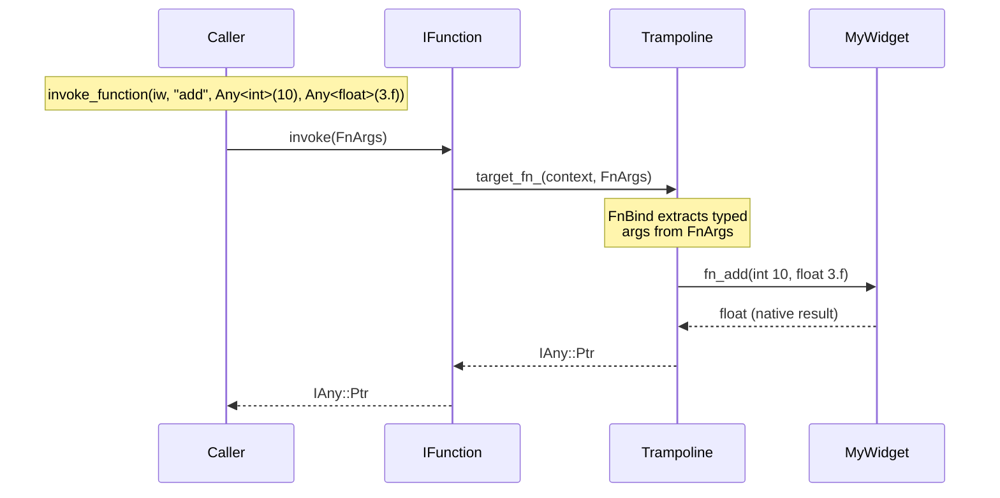
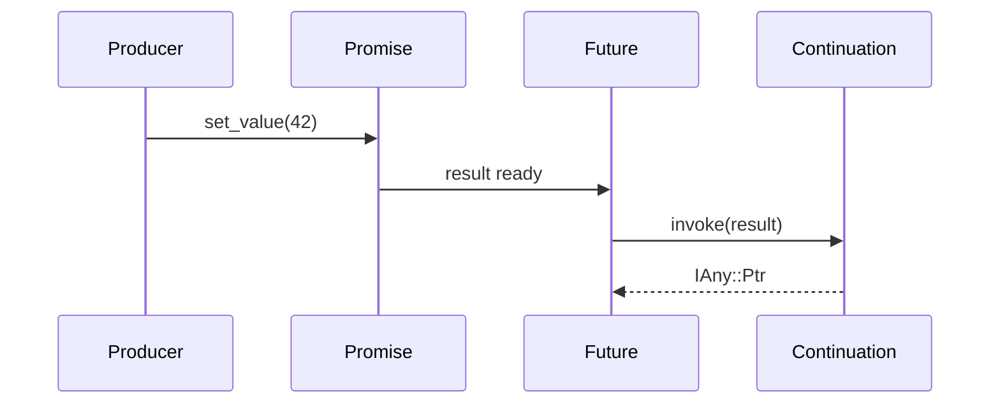

# Guide

This guide covers advanced topics beyond the basics shown in the [README](../README.md).

## Contents

- [Class UIDs](#class-uids)
- [Virtual function dispatch](#virtual-function-dispatch)
  - [Function arguments](#function-arguments)
  - [Typed lambda parameters](#typed-lambda-parameters)
- [Properties with change notifications](#properties-with-change-notifications)
- [Custom Any types](#custom-any-types)
- [Direct state access](#direct-state-access)
- [Deferred invocation](#deferred-invocation)
  - [Defer at the call site](#defer-at-the-call-site)
  - [Deferred event handlers](#deferred-event-handlers)
- [Futures and promises](#futures-and-promises)
  - [Basic usage](#basic-usage)
  - [Continuations](#continuations)
  - [Then chaining](#then-chaining)
  - [Type transforms](#type-transforms)
  - [Thread safety](#thread-safety)

## Class UIDs

Every class that inherits from `ObjectCore` or `Object` has a class UID returned by `class_id()` (compile-time) or `get_class_uid()` (virtual, on IObject). By default this is auto-generated from the class name via constexpr FNV-1a hashing. You can override it with a stable, user-specified UID using the `VELK_CLASS_UID` macro:

```cpp
class MyWidget : public ext::Object<MyWidget, IMyWidget>
{
    VELK_CLASS_UID("a0b1c2d3-e4f5-6789-abcd-ef0123456789");
    // or static constexpr ::velk::Uid class_uid{"a0b1c2d3-e4f5-6789-abcd-ef0123456789"}

    void fn_reset() override { /* ... */ }
};
```

The UID string is validated at compile time; a malformed or wrong-length string produces a compile error.

User-specified UIDs are useful when you want to:

- **Export stable UIDs** in public headers without exposing internal class names.
- **Create instances by well-known UID** across DLL boundaries, where class names may differ.
- **Maintain ABI stability**, auto-generated UIDs change if the class is renamed or moved to a different namespace.

For example, the built-in `Property`, `Function` and `Future` objects use this mechanism. Their UIDs are defined in `ClassId` namespace in `types.h`:

```cpp
namespace ClassId {
inline constexpr Uid Property{"a66badbf-c750-4580-b035-b5446806d67e"};
inline constexpr Uid Function{"d3c150cc-0b2b-4237-93c5-5a16e9619be8"};
inline constexpr Uid Future{"371dfa91-1cf7-441e-b688-20d7e0114745"};
}
```

## Virtual function dispatch

`VELK_INTERFACE` supports three function forms. `(FN, RetType, Name)` generates a zero-arg virtual `RetType fn_Name()`. `(FN, RetType, Name, (T1, a1), ...)` generates a typed virtual `RetType fn_Name(T1 a1, ...)` with automatic argument extraction from `FnArgs` and return value wrapping. `(FN_RAW, Name)` generates `fn_Name(FnArgs)` for manual argument handling.



```cpp
class IMyWidget : public Interface<IMyWidget>
{
public:
    VELK_INTERFACE(
        (PROP, float, width, 0.f),
        (FN, void, reset),                       // virtual void fn_reset()
        (FN, float, add, (int, x), (float, y)),  // virtual float fn_add(int x, float y)
        (FN_RAW, process)                         // virtual IAny::Ptr fn_process(FnArgs)
    )
};

class MyWidget : public ext::Object<MyWidget, IMyWidget>
{
    void fn_reset() override {
        std::cout << "reset!" << std::endl;
    }

    float fn_add(int x, float y) override {
        std::cout << x + y << std::endl;
        return x + y;           // wrapped into IAny::Ptr by trampoline
    }

    IAny::Ptr fn_process(FnArgs args) override {
        // manual unpacking via FunctionContext or Any<const T>
        return nullptr;
    }
};

// All forms are invoked through IFunction::invoke()
auto widget = instance().create<IObject>(MyWidget::class_id());
if (auto* iw = interface_cast<IMyWidget>(widget)) {
    invoke_function(iw->reset());                               // zero-arg
    invoke_function(iw, "add", Any<int>(10), Any<float>(3.f));  // typed
    invoke_function(iw->process());                             // raw
}
```

Each `fn_Name` is pure virtual, so implementing classes must override it. An explicit `set_invoke_callback()` takes priority over the virtual.

### Function arguments

For **typed-arg** functions (`(FN, RetType, Name, (T1, a1), ...)`), the trampoline extracts typed values from `FnArgs` automatically — the override receives native C++ parameters. If fewer arguments are provided than expected, the trampoline returns `nullptr`.

For **FN_RAW** functions, arguments arrive as `FnArgs` — a lightweight non-owning view of `{const IAny* const* data, size_t count}`. Access individual arguments with bounds-checked indexing (`args[i]` returns nullptr if out of range) and check the count with `args.count`. Use `FunctionContext` to validate the expected argument count:

```cpp
IAny::Ptr fn_process(FnArgs args) override {
    if (auto ctx = FunctionContext(args, 2)) {
        auto a = ctx.arg<float>(0);
        auto b = ctx.arg<int>(1);
        // ...
    }
    return nullptr;
}
```

Callers use variadic `invoke_function` overloads — values are automatically wrapped in `Any<T>`:

```cpp
invoke_function(iw->reset());                                   // zero-arg
invoke_function(iw, "add", Any<int>(10), Any<float>(3.14f));    // typed args
invoke_function(iw->process(), Any<int>(42));                   // single IAny arg
invoke_function(widget.get(), "process", 1.f, 2u);             // multi-value (auto-wrapped)
```

### Typed lambda parameters

`Callback` also accepts lambdas with typed parameters. Arguments are automatically extracted from `FnArgs` using `Any<const T>`, so there's no manual unpacking:

```cpp
Callback fn([&](const float& a, const int& b) -> ReturnValue {
    // a and b are extracted from FnArgs automatically
    return ReturnValue::SUCCESS;
});

Any<float> x(3.14f);
Any<int> y(42);
const IAny* ptrs[] = {x, y};
fn.invoke(FnArgs{ptrs, 2});
```

Void-returning lambdas are supported — `Callback` wraps them to return `nullptr`:

```cpp
Callback fn([&](float value) {
    std::cout << "received: " << value << std::endl;
});
```

Zero-arity lambdas work too:

```cpp
Callback fn([&]() {
    std::cout << "called!" << std::endl;
});
fn.invoke();  // SUCCESS
```

The three constructor forms are mutually exclusive via SFINAE:

| Callable type | Constructor |
|---|---|
| `IAny::Ptr(*)(FnArgs)` (raw function pointer) | `Callback(CallbackFn*)` |
| Callable with `(FnArgs) -> ReturnValue` or `(FnArgs) -> IAny::Ptr` | Capturing lambda ctor |
| Callable with typed params (any return) | Typed lambda ctor |

`invoke()` returns `IAny::Ptr` — `nullptr` for void results, or a typed result. Typed-return lambdas have their result automatically wrapped via `Any<R>`. When fewer arguments are provided than the lambda expects, `invoke()` returns `nullptr`. Extra arguments are ignored. If an argument's type doesn't match the lambda parameter type, the parameter receives a default-constructed value.

## Properties with change notifications

```cpp
auto prop = Property<float>();
prop.set_value(5.f);

Callback onChange([](FnArgs args) -> ReturnValue {
    if (auto v = Any<const float>(args[0])) {
        std::cout << "new value: " << v.get_value() << std::endl;
    }
    return ReturnValue::SUCCESS;
});
prop.add_on_changed(onChange);

prop.set_value(10.f);  // triggers onChange
```

## Custom Any types

Implement `ext::AnyCore` to back a property with external or shared data:

```cpp
class MyDataAny final : public ext::AnyCore<MyDataAny, Data, IExternalAny>
{
public:
    Data& get_value() const override { return globalData_; }
    ReturnValue set_value(const Data& value) override {
        globalData_ = value;
        invoke_event(on_data_changed(), this);
        return ReturnValue::SUCCESS;
    }
    IEvent::Ptr on_data_changed() const override { return onChanged_; }
};
```

## Direct state access

Each interface that declares `PROP` members gets a `State` struct with one field per property, initialized with its declared default. `ext::Object` stores these structs inline, and properties read/write directly into them via `ext::AnyRef<T>`. You can also access the state struct directly through `IPropertyState`, bypassing the property layer entirely.

```cpp
auto widget = instance().create<IObject>(MyWidget::class_id());
auto* iw = interface_cast<IMyWidget>(widget);
auto* ps = interface_cast<IPropertyState>(widget);

// Typed access: returns IMyWidget::State*
auto* state = ps->get_property_state<IMyWidget>();

// State fields are initialized with VELK_INTERFACE defaults
state->width;   // 100.f
state->height;  // 50.f

// Write through property API, state reflects it
iw->width().set_value(200.f);
state->width;   // 200.f

// Write to state directly, property reads it back
state->height = 75.f;
iw->height().get_value();  // 75.f
```

This is useful for bulk operations like serialization, snapshotting (via `memcpy` for trivially-copyable state), or cases where you want to process raw data without going through the property layer.

Each interface's state is independent:

```cpp
auto* ws = ps->get_property_state<IMyWidget>();       // IMyWidget::State*
auto* ss = ps->get_property_state<ISerializable>();   // ISerializable::State*
```

## Deferred invocation

Functions and event handlers support deferred execution via the `InvokeType` enum (`Immediate` or `Deferred`). Deferred work is queued and executed when `::velk::instance().update()` is called.


### Defer at the call site

Pass `Deferred` to `invoke()` to queue the entire invocation:

```cpp
auto fn = iw->reset();
invoke_function(fn, args);                                // executes now (default)
invoke_function(fn, args, InvokeType::Deferred);          // queued for update()
```

### Deferred event handlers

Register a handler as deferred so it is queued each time the event fires, while immediate handlers on the same event still execute synchronously:

```cpp
auto event = iw->on_clicked();
event->add_handler(immediateHandler);                        // fires synchronously
event->add_handler(deferredHandler, InvokeType::Deferred);   // queued for update()

invoke_event(event, args);  // immediateHandler runs now, deferredHandler is queued
instance().update();        // deferredHandler runs here
```

Arguments are cloned when a task is queued, so the original `IAny` does not need to outlive the call. Deferred tasks that themselves produce deferred work will re-queue, and will be handled when `update()` is called the next time.

## Futures and promises

Velk provides `Promise` and `Future<T>` for asynchronous value delivery. A `Promise` is the write side — it resolves a value. A `Future<T>` is the read side, it waits for or reacts to the value. Both are lightweight wrappers around `IFuture` interface backed by `FutureImpl` in the DLL.



### Basic usage

Create a promise, hand out its future, and resolve it later:

```cpp
#include <api/future.h>

auto promise = make_promise();
auto future = promise.get_future<int>();

// Consumer side
future.wait();                          // blocks until ready
int value = future.get_result().get_value();

// Producer side (possibly from another thread)
promise.set_value(42);                  // resolves the future
```

For void futures (signaling completion without a value):

```cpp
auto promise = make_promise();
auto future = promise.get_future<void>();

promise.complete();                     // resolves without a value
```

Resolving twice returns `NOTHING_TO_DO` and the first value persists:

```cpp
promise.set_value(1);                   // SUCCESS
promise.set_value(2);                   // NOTHING_TO_DO — first value wins
```

### Continuations

Attach a callback that fires when the future resolves. If the future is already ready, the continuation fires immediately:

```cpp
auto promise = make_promise();
auto future = promise.get_future<int>();

// FnArgs continuation — receives the result as args[0]
future.then([](FnArgs args) -> ReturnValue {
    if (auto ctx = FunctionContext(args, 1)) {
        std::cout << "got: " << ctx.arg<int>(0).get_value() << std::endl;
    }
    return ReturnValue::SUCCESS;
});

// Typed continuation — arguments are auto-extracted
future.then([](int value) {
    std::cout << "got: " << value << std::endl;
});

promise.set_value(42);                  // fires both continuations
```

Deferred continuations are queued for `instance().update()`:

```cpp
future.then([](int value) {
    std::cout << value << std::endl;
}, Deferred);

promise.set_value(42);                  // continuation is queued, not fired
instance().update();                    // continuation fires here
```

### Then chaining

`.then()` returns a new `Future` that resolves with the continuation's return value. This enables fluent chaining:

```cpp
auto promise = make_promise();

auto result = promise.get_future<int>()
    .then([](int v) -> int { return v * 2; })
    .then([](int v) -> int { return v + 1; });

promise.set_value(5);
// result is Future<int>, resolves to 11: (5 * 2) + 1
```

Void-returning continuations produce `Future<void>`:

```cpp
auto done = promise.get_future<int>()
    .then([](int v) { std::cout << v << std::endl; });
// done is Future<void>
```

### Type transforms

Continuations can change the value type between chain steps:

```cpp
auto promise = make_promise();

// int -> float
auto result = promise.get_future<int>()
    .then([](int v) -> float { return v * 1.5f; });

promise.set_value(10);
// result is Future<float>, resolves to 15.f
```

Chaining from a void future is also supported:

```cpp
auto promise = make_promise();
auto result = promise.get_future<void>()
    .then([]() -> int { return 42; });

promise.complete();
// result is Future<int>, resolves to 42
```

### Thread safety

`Promise` and `Future` are safe to use across threads. `wait()` blocks until the result is available, and multiple threads can wait on the same future:

```cpp
auto promise = make_promise();
auto future = promise.get_future<int>();

std::thread consumer([&] {
    future.wait();                      // blocks until ready
    int v = future.get_result().get_value();
});

promise.set_value(42);                  // unblocks the consumer
consumer.join();
```

Resolution, waiting, and continuation dispatch are all mutex-protected internally. Continuations added after resolution fire immediately (for `Immediate` type) or are queued (for `Deferred` type).
