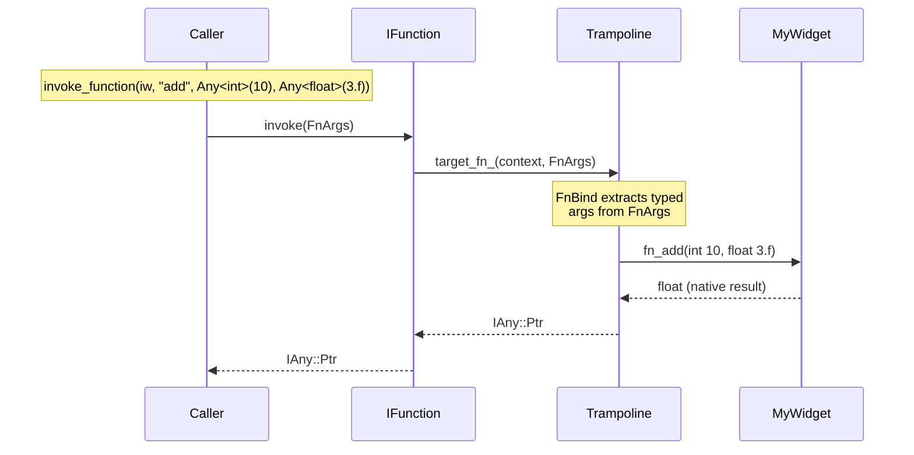
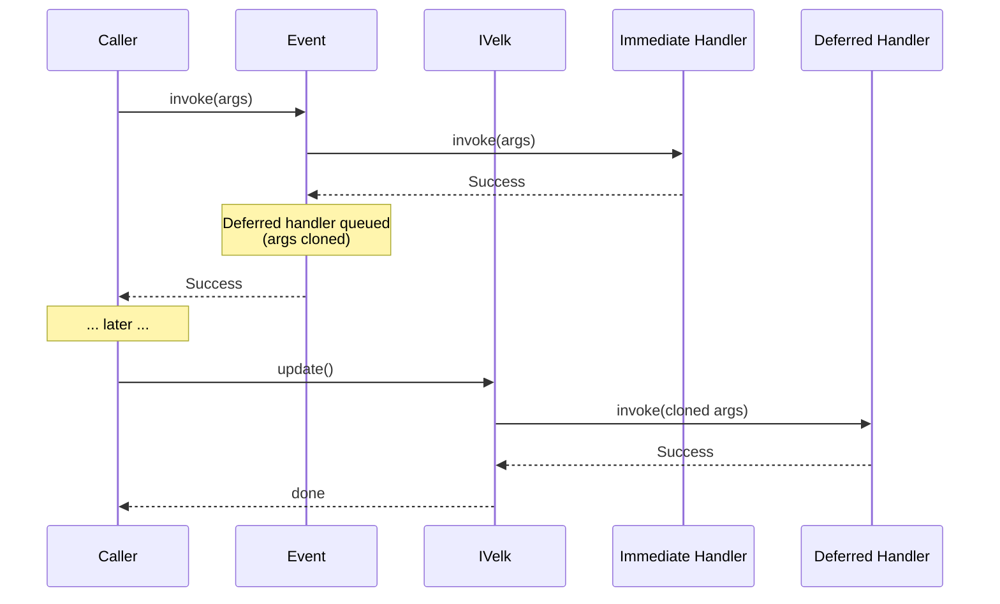
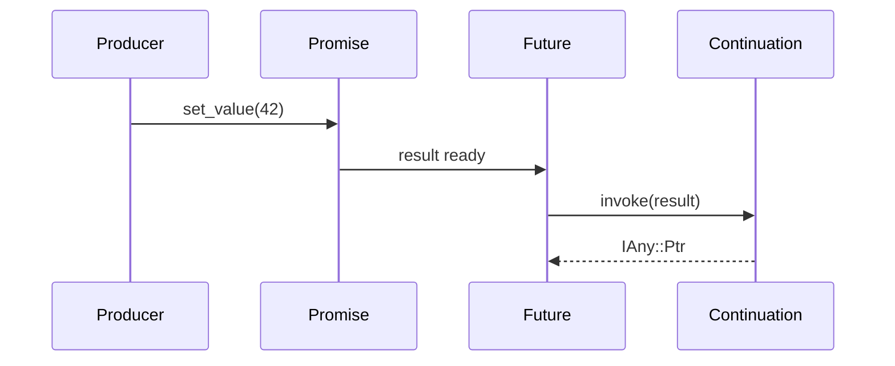

# Guide

This guide covers topics beyond the basics shown in the [README](../README.md). Start here after reading the quick start.

## Contents

- [Declaring interfaces](#declaring-interfaces)
  - [VELK_INTERFACE syntax](#velk_interface-syntax)
  - [Practical example](#practical-example)
  - [Array property members](#array-property-members)
  - [Function member variants](#function-member-variants)
  - [Argument metadata](#argument-metadata)
- [Class UIDs](#class-uids)
- [Functions and events](#functions-and-events)
  - [Virtual function dispatch](#virtual-function-dispatch)
  - [Function arguments](#function-arguments)
  - [Typed lambda parameters](#typed-lambda-parameters)
  - [Deferred invocation](#deferred-invocation)
    - [Defer at the call site](#defer-at-the-call-site)
    - [Deferred event handlers](#deferred-event-handlers)
  - [Futures and promises](#futures-and-promises)
    - [Basic usage](#basic-usage)
    - [Continuations](#continuations)
    - [Then chaining](#then-chaining)
    - [Type transforms](#type-transforms)
    - [Thread safety](#thread-safety)
  - [Task pools](#task-pools)
    - [Threaded pools](#threaded-pools)
    - [Manual pools](#manual-pools)
    - [Lifetime](#lifetime)
- [Properties](#properties)
  - [Change notifications](#change-notifications)
  - [Custom Any types](#custom-any-types)
  - [Variant properties](#variant-properties)
  - [Object reference properties](#object-reference-properties)
  - [Direct state access](#direct-state-access)
    - [read_state / write_state](#read_state--write_state)
    - [Raw state pointer](#raw-state-pointer)
  - [Deferred property assignment](#deferred-property-assignment)
    - [Deferred write_state](#deferred-write_state)
  - [Bindings](#bindings)
    - [Property-to-property binding](#property-to-property-binding)
    - [Function binding](#function-binding)
    - [Auto-tracked binding](#auto-tracked-binding)
    - [Deferred bindings](#deferred-bindings)
    - [Two-way bindings](#two-way-bindings)
    - [Multiple targets](#multiple-targets)
    - [Removing bindings](#removing-bindings)
    - [Loop detection](#loop-detection)
- [Attachments](#attachments)
  - [Adding and removing](#adding-and-removing)
  - [Finding attachments](#finding-attachments)
  - [Find or create](#find-or-create)
- [Hierarchy](#hierarchy)
  - [Events](#events)
  - [IHierarchyAware](#ihierarchyaware)

## Declaring interfaces

Use `VELK_INTERFACE` inside an `Interface<T>` subclass to declare properties, events, and functions. The macro generates a static constexpr metadata array, typed accessor methods, and (for `FN` members) pure virtual methods with trampolines.

### VELK_INTERFACE syntax

```cpp
VELK_INTERFACE(
    (PROP, Type, Name, Default),              // Property<Type> Name() const
    (RPROP, Type, Name, Default),             // ConstProperty<Type> Name() const (read-only)
    (ARR, Type, Name),                        // ArrayProperty<Type> Name() const
    (ARR, Type, Name, v1, v2, v3),            // ArrayProperty<Type> Name() const (default {v1,v2,v3})
    (RARR, Type, Name, v1, v2),              // ConstArrayProperty<Type> Name() const (read-only)
    (EVT, Name),                              // Event Name() const                (zero-arg)
    (EVT, Name, (T1, a1), (T2, a2)),          // Event Name() const                (typed signature)
    (FN, RetType, Name),                      // virtual RetType fn_Name()          (zero-arg)
    (FN, RetType, Name, (T1, a1), (T2, a2)),  // virtual RetType fn_Name(T1 a1, T2 a2) (typed)
    (FN_RAW, Name)                            // virtual fn_Name(FnArgs)   (raw untyped)
)
```

Each entry produces a `MemberDesc` in a `static constexpr std::array metadata` and a typed accessor method. Up to 32 members per interface. Up to 8 typed parameters per function or event. Members track which interface declared them via `InterfaceInfo`. Array properties use `MemberKind::ArrayProperty` and are backed by `ClassId::ArrayProperty` at runtime.

Events with a typed signature carry an `FnArgDesc` array describing each argument's name and type. The signature is metadata only — `Event::invoke()` still takes `FnArgs` — but it documents intent and lets runtime tooling (script bindings, debug UIs, validators) know what handlers should expect. Access via `MemberDesc::functionKind()->args` on Event members.

### Practical example

```cpp
class IMyWidget : public Interface<IMyWidget>
{
public:
    VELK_INTERFACE(
        (PROP, float, width, 0.f),
        (ARR, float, weights, 1.f, 2.f, 3.f),     // array with defaults
        (RARR, int32_t, tags),                      // read-only array, empty default
        (EVT, on_clicked),                          // zero-arg event
        (EVT, on_resized, (int, w), (int, h)),     // typed event signature
        (FN, void, reset),                          // zero-arg, void return
        (FN, float, add, (int, x), (float, y))     // typed args, typed return
    )
};

class ISerializable : public Interface<ISerializable>
{
public:
    VELK_INTERFACE(
        (PROP, std::string, name, ""),
        (FN_RAW, serialize)                 // raw FnArgs
    )
};

class MyWidget : public ext::Object<MyWidget, IMyWidget, ISerializable>
{
    void fn_reset() override {
        // void return, trampoline returns nullptr to IFunction::invoke()
    }

    float fn_add(int x, float y) override {
        // x and y are extracted from FnArgs automatically
        // return value is wrapped into IAny::Ptr by the trampoline
        return x + y;
    }

    IAny::Ptr fn_serialize(FnArgs args) override {
        // manual arg unpacking via FunctionContext or Any<const T>
        return nullptr;
    }
};
```

Invocation works the same for all variants, callers always go through `IFunction::invoke()`:

```cpp
auto widget = instance().create<IObject>(MyWidget::static_class_id());
if (auto* iw = interface_cast<IMyWidget>(widget)) {
    // Scalar property
    iw->width().set_value(100.f);

    // Array property: element-level access
    iw->weights().push_back(4.f);
    float w = iw->weights().at(0);      // 1.f
    iw->weights().set_at(0, 10.f);
    iw->weights().erase_at(2);

    // Read-only array property
    size_t n = iw->tags().size();
    // iw->tags().push_back(42);         // won't compile: ConstArrayProperty

    // Functions
    invoke_function(iw->reset());                            // zero-arg
    invoke_function(iw, "add", Any<int>(10), Any<float>(3.14f)); // typed
}
if (auto* is = interface_cast<ISerializable>(widget)) {
    invoke_function(is, "serialize");                         // FN_RAW
}
```

### Array property members

`ARR` and `RARR` declare array properties backed by `velk::vector<T>` in the State struct. They provide element-level access (get, set, push, erase) without copying the full vector.

| Syntax | Accessor return type | Mutability |
|--------|---------------------|------------|
| `(ARR, float, items)` | `ArrayProperty<float>` | Read-write |
| `(ARR, float, items, 1.f, 2.f)` | `ArrayProperty<float>` | Read-write, default `{1.f, 2.f}` |
| `(RARR, int, ids)` | `ConstArrayProperty<int>` | Read-only |
| `(RARR, int, ids, 10, 20)` | `ConstArrayProperty<int>` | Read-only, default `{10, 20}` |

Default values are variadic: any arguments after the name become the initializer list for the vector.

#### API wrappers

`ConstArrayProperty<T>` (returned by `RARR`) provides read-only access:

```cpp
size_t size() const;
bool empty() const;
T at(size_t index) const;           // single element, no full vector copy
vector<T> get_value() const;        // full copy when needed
```

`ArrayProperty<T>` (returned by `ARR`) adds mutation:

```cpp
ReturnValue set_at(size_t index, const T& value);
ReturnValue push_back(const T& value);
ReturnValue erase_at(size_t index);
void clear();
ReturnValue set_value(const vector<T>& value, InvokeType type = Auto);
```

#### ArrayAny\<T\>

`ArrayAny<T>` (in `api/any.h`) is a typed wrapper for `IArrayAny`, similar to how `Any<T>` wraps `IAny`. It can be value-constructed (owning) or wrap an existing `IAny::Ptr`/`IAny::ConstPtr`. Use `const T` for read-only access:

```cpp
// Owning: default-constructed empty array
ArrayAny<float> empty;

// Owning: from initializer list
ArrayAny<float> arr({3.14f, 2.71f});
float val = arr.at(0);

// Owning: from array_view
float data[] = {1.f, 2.f, 3.f};
ArrayAny<float> fromView(array_view<float>(data, 3));

// Wrapping an existing IAny::Ptr
ArrayAny<float> wrapped(some_any_ptr);
wrapped.push_back(42.f);

// Read-only: constructed from IAny::ConstPtr, mutation methods are disabled
ArrayAny<const float> readonly_arr(some_const_any_ptr);
float v = readonly_arr.at(0);         // OK
// readonly_arr.push_back(1.f);       // compile error
```

#### Architecture

Array properties use `IArrayAny` for element-level operations. When the macro generates `ArrBind<State, &State::member>`, it produces a `PropertyKind` whose `createRef` returns an `ArrayAnyRef<T>` (in `ext/any.h`). This ref implements both `IAny` (whole-vector get/set) and `IArrayAny` (element ops). `ClassId::ArrayProperty` delegates element operations to `interface_cast<IArrayAny>(data_)` on its backing Any, and wraps them in `on_changed` notifications.

### Function member variants

`FN` and `FN_RAW` are the two tags for function members. `FN` supports zero-arg and typed-arg forms; `FN_RAW` preserves the untyped `FnArgs` signature.

| Syntax | Virtual generated | Arg metadata | Use case |
|--------|------------------|--------------|----------|
| `(FN, void, reset)` | `void fn_reset()` | none | Zero-arg void functions |
| `(FN, int, add, (int, x), (float, y))` | `int fn_add(int x, float y)` | `FnArgDesc` per param | Typed args with return value |
| `(FN_RAW, process)` | `IAny::Ptr fn_process(FnArgs)` | none | Raw untyped args |

All three variants generate:
1. A pure virtual method (signature depends on variant)
2. A `static constexpr FunctionKind` with a trampoline (via `detail::FnBind` or `detail::FnRawBind`) that routes `IFunction::invoke()` to the virtual
3. A `MemberDesc` with the trampoline pointer in the metadata array
4. An accessor `Function Name() const`

For `FN` members, `RetType` specifies the native C++ return type of the virtual method. The trampoline wraps the result into `IAny::Ptr` automatically: `void` returns `nullptr`, other types are wrapped via `Any<R>::clone()`. `FN_RAW` always returns `IAny::Ptr`.

For typed-arg functions, the trampoline automatically extracts each argument from `FnArgs` using `IAny::get_data()` with type deduction from the member function pointer. If fewer arguments are provided than expected, the trampoline returns `nullptr`. Extra arguments are ignored.

### Argument metadata

Typed-arg functions store a `static constexpr FnArgDesc[]` array alongside the trampoline in `FunctionKind`:

```cpp
struct FnArgDesc {
    std::string_view name;   // parameter name (e.g. "x")
    Uid typeUid;             // type_uid<T>() for the parameter type
};

struct FunctionKind {
    FnTrampoline trampoline;
    array_view<FnArgDesc> args;  // empty for zero-arg and FN_RAW
};
```

Access via `MemberDesc::functionKind()->args`:

```cpp
if (auto* info = instance().type_registry().get_class_info(MyWidget::static_class_id())) {
    for (auto& m : info->members) {
        if (auto* fk = m.functionKind(); fk && !fk->args.empty()) {
            for (auto& arg : fk->args) {
                // arg.name, arg.typeUid
            }
        }
    }
}
```

For the full hand-written equivalent of what `VELK_INTERFACE` generates, see [Advanced topics](advanced.md).

## Class UIDs

Every class that inherits from `ObjectCore` or `Object` has a class UID returned by `static_class_id()` (compile-time) or `get_class_uid()` (virtual, on IObject). By default this is auto-generated from the class name via constexpr FNV-1a hashing. You can override it with a stable, user-specified UID using the `VELK_CLASS_UID` macro. The macro also accepts an optional second parameter to set a friendly class name:

```cpp
class MyWidget : public ext::Object<MyWidget, IMyWidget>
{
    VELK_CLASS_UID("a0b1c2d3-e4f5-6789-abcd-ef0123456789");
    // or static constexpr ::velk::Uid class_uid{"a0b1c2d3-e4f5-6789-abcd-ef0123456789"}

    void fn_reset() override { /* ... */ }
};
```

The UID string is validated at compile time; a malformed or wrong-length string produces a compile error.

User-specified UIDs are useful when you want to:

- **Export stable UIDs** in public headers without exposing internal class names.
- **Create instances by well-known UID** across DLL boundaries, where class names may differ.
- **Maintain ABI stability**, auto-generated UIDs change if the class is renamed or moved to a different namespace.

For example, the built-in `Property`, `Function` and `Future` objects use this mechanism. Their UIDs are defined in `ClassId` namespace in `types.h`:

```cpp
namespace ClassId {
inline constexpr Uid Property{"a66badbf-c750-4580-b035-b5446806d67e"};
inline constexpr Uid Function{"d3c150cc-0b2b-4237-93c5-5a16e9619be8"};
inline constexpr Uid Future{"371dfa91-1cf7-441e-b688-20d7e0114745"};
}
```

## Functions and events

Functions are type-erased callables declared in interfaces via `FN` or `FN_RAW`. Events are multicast delegates declared via `EVT`. Both support immediate and deferred invocation.

### Virtual function dispatch

`VELK_INTERFACE` supports three function forms. `(FN, RetType, Name)` generates a zero-arg virtual `RetType fn_Name()`. `(FN, RetType, Name, (T1, a1), ...)` generates a typed virtual `RetType fn_Name(T1 a1, ...)` with automatic argument extraction from `FnArgs` and return value wrapping. `(FN_RAW, Name)` generates `fn_Name(FnArgs)` for manual argument handling.


```mermaid
sequenceDiagram
    participant Caller
    participant IFunction
    participant Trampoline
    participant MyWidget

    Note over Caller: invoke_function(iw, "add", Any<int>(10), Any<float>(3.f))

    Caller->>IFunction: invoke(FnArgs)
    IFunction->>Trampoline: target_fn_(context, FnArgs)
    Note over Trampoline: FnBind extracts typed<br>args from FnArgs
    Trampoline->>MyWidget: fn_add(int 10, float 3.f)
    MyWidget-->>Trampoline: float (native result)
    Trampoline-->>IFunction: IAny::Ptr
    IFunction-->>Caller: IAny::Ptr
```

```cpp
class IMyWidget : public Interface<IMyWidget>
{
public:
    VELK_INTERFACE(
        (PROP, float, width, 0.f),
        (FN, void, reset),                       // virtual void fn_reset()
        (FN, float, add, (int, x), (float, y)),  // virtual float fn_add(int x, float y)
        (FN_RAW, process)                         // virtual IAny::Ptr fn_process(FnArgs)
    )
};

class MyWidget : public ext::Object<MyWidget, IMyWidget>
{
    void fn_reset() override {
        std::cout << "reset!" << std::endl;
    }

    float fn_add(int x, float y) override {
        std::cout << x + y << std::endl;
        return x + y;           // wrapped into IAny::Ptr by trampoline
    }

    IAny::Ptr fn_process(FnArgs args) override {
        // manual unpacking via FunctionContext or Any<const T>
        return nullptr;
    }
};

// All forms are invoked through IFunction::invoke()
auto widget = instance().create<IObject>(MyWidget::static_class_id());
if (auto* iw = interface_cast<IMyWidget>(widget)) {
    invoke_function(iw->reset());                               // zero-arg
    invoke_function(iw, "add", Any<int>(10), Any<float>(3.f));  // typed
    invoke_function(iw->process());                             // raw
}
```

Each `fn_Name` is pure virtual, so implementing classes must override it. An explicit `set_invoke_callback()` takes priority over the virtual.

#### Function arguments

For **typed-arg** functions (`(FN, RetType, Name, (T1, a1), ...)`), the trampoline extracts typed values from `FnArgs` automatically, the override receives native C++ parameters. If fewer arguments are provided than expected, the trampoline returns `nullptr`.

For **FN_RAW** functions, arguments arrive as `FnArgs`, a lightweight non-owning view of `{const IAny* const* data, size_t count}`. Access individual arguments with bounds-checked indexing (`args[i]` returns nullptr if out of range) and check the count with `args.count`. Use `FunctionContext` to validate the expected argument count:

```cpp
IAny::Ptr fn_process(FnArgs args) override {
    if (auto ctx = FunctionContext(args, 2)) {
        auto a = ctx.arg<float>(0);
        auto b = ctx.arg<int>(1);
        // ...
    }
    return nullptr;
}
```

Callers use variadic `invoke_function` overloads, values are automatically wrapped in `Any<T>`:

```cpp
invoke_function(iw->reset());                                   // zero-arg
invoke_function(iw, "add", Any<int>(10), Any<float>(3.14f));    // typed args
invoke_function(iw->process(), Any<int>(42));                   // single IAny arg
invoke_function(widget.get(), "process", 1.f, 2u);             // multi-value (auto-wrapped)
```

#### Typed lambda parameters

`Callback` also accepts lambdas with typed parameters. Arguments are automatically extracted from `FnArgs` using `Any<const T>`, so there's no manual unpacking:

```cpp
Callback fn([&](const float& a, const int& b) -> ReturnValue {
    // a and b are extracted from FnArgs automatically
    return ReturnValue::Success;
});

Any<float> x(3.14f);
Any<int> y(42);
const IAny* ptrs[] = {x, y};
fn.invoke(FnArgs{ptrs, 2});
```

Void-returning lambdas are supported, `Callback` wraps them to return `nullptr`:

```cpp
Callback fn([&](float value) {
    std::cout << "received: " << value << std::endl;
});
```

Zero-arity lambdas work too:

```cpp
Callback fn([&]() {
    std::cout << "called!" << std::endl;
});
fn.invoke();  // Success
```

The three constructor forms are mutually exclusive via SFINAE:

| Callable type | Constructor |
|---|---|
| `IAny::Ptr(*)(FnArgs)` (raw function pointer) | `Callback(CallbackFn*)` |
| Callable with `(FnArgs) -> ReturnValue` or `(FnArgs) -> IAny::Ptr` | Capturing lambda ctor |
| Callable with typed params (any return) | Typed lambda ctor |

`invoke()` returns `IAny::Ptr`, `nullptr` for void results, or a typed result. Typed-return lambdas have their result automatically wrapped via `Any<R>`. When fewer arguments are provided than the lambda expects, `invoke()` returns `nullptr`. Extra arguments are ignored. If an argument's type doesn't match the lambda parameter type, the parameter receives a default-constructed value.

### Invocation modes

Functions, events, and properties use the `InvokeType` enum to control execution timing:

| Mode | Value | Behavior |
|---|---|---|
| `Auto` | 0 | Default. Compares the calling thread to the object's owner thread. Same thread resolves to `Immediate`; different thread resolves to `Deferred`. |
| `Immediate` | 1 | Executes synchronously on the calling thread. |
| `Deferred` | 2 | Queues work for the next `instance().update()` call. |

`Auto` is the default for all APIs. It adds one thread ID comparison per call. Use `Immediate` to opt out for zero overhead, or `Deferred` to explicitly queue.

### Deferred invocation

Deferred work is queued and executed when `::velk::instance().update()` is called.


```mermaid
sequenceDiagram
    participant Caller
    participant Event
    participant IVelk
    participant Immediate as Immediate Handler
    participant Deferred as Deferred Handler

    Caller->>Event: invoke(args)
    Event->>Immediate: invoke(args)
    Immediate-->>Event: Success
    Note over Event: Deferred handler queued<br>(args cloned)
    Event-->>Caller: Success

    Note over Caller: ... later ...

    Caller->>IVelk: update()
    IVelk->>Deferred: invoke(cloned args)
    Deferred-->>IVelk: Success
    IVelk-->>Caller: done
```

#### Defer at the call site

Pass `Deferred` to `invoke()` to queue the entire invocation:

```cpp
auto fn = iw->reset();
invoke_function(fn, args);                                // Auto (default): same thread = immediate
invoke_function(fn, args, Immediate);                     // always executes now
invoke_function(fn, args, Deferred);                      // always queued for update()
```

#### Deferred event handlers

Register a handler as deferred so it is queued each time the event fires, while immediate handlers on the same event still execute synchronously:

```cpp
auto event = iw->on_clicked();
event->add_handler(immediateHandler);                        // Auto: same thread = immediate
event->add_handler(deferredHandler, Deferred);               // always queued for update()

invoke_event(event, args);  // immediateHandler runs now, deferredHandler is queued
instance().update();        // deferredHandler runs here
```

Arguments are cloned when a task is queued, so the original `IAny` does not need to outlive the call. Deferred tasks that themselves produce deferred work will re-queue, and will be handled when `update()` is called the next time.

### Futures and promises

Velk provides `Promise` and `Future<T>` for asynchronous value delivery. A `Promise` is the write side, it resolves a value. A `Future<T>` is the read side, it waits for or reacts to the value. Both are lightweight wrappers around `IFuture` interface backed by `FutureImpl` in the DLL.


```mermaid
sequenceDiagram
    participant Producer
    participant Promise
    participant Future
    participant Continuation

    Producer->>Promise: set_value(42)
    Promise->>Future: result ready
    Future->>Continuation: invoke(result)
    Continuation-->>Future: IAny::Ptr
```

#### Basic usage

Create a promise, hand out its future, and resolve it later:

```cpp
#include <api/future.h>

auto promise = make_promise();
auto future = promise.get_future<int>();

// Consumer side
future.wait();                          // blocks until ready
int value = future.get_result().get_value();

// Producer side (possibly from another thread)
promise.set_value(42);                  // resolves the future
```

For void futures (signaling completion without a value):

```cpp
auto promise = make_promise();
auto future = promise.get_future<void>();

promise.complete();                     // resolves without a value
```

Resolving twice returns `NothingToDo` and the first value persists:

```cpp
promise.set_value(1);                   // Success
promise.set_value(2);                   // NothingToDo, first value wins
```

#### Continuations

Attach a callback that fires when the future resolves. If the future is already ready, the continuation fires immediately:

```cpp
auto promise = make_promise();
auto future = promise.get_future<int>();

// FnArgs continuation, receives the result as args[0]
future.then([](FnArgs args) -> ReturnValue {
    if (auto ctx = FunctionContext(args, 1)) {
        std::cout << "got: " << ctx.arg<int>(0).get_value() << std::endl;
    }
    return ReturnValue::Success;
});

// Typed continuation, arguments are auto-extracted
future.then([](int value) {
    std::cout << "got: " << value << std::endl;
});

promise.set_value(42);                  // fires both continuations
```

Deferred continuations are queued for `instance().update()`:

```cpp
future.then([](int value) {
    std::cout << value << std::endl;
}, Deferred);

promise.set_value(42);                  // continuation is queued, not fired
instance().update();                    // continuation fires here
```

#### Then chaining

`.then()` returns a new `Future` that resolves with the continuation's return value. This enables fluent chaining:

```cpp
auto promise = make_promise();

auto result = promise.get_future<int>()
    .then([](int v) -> int { return v * 2; })
    .then([](int v) -> int { return v + 1; });

promise.set_value(5);
// result is Future<int>, resolves to 11: (5 * 2) + 1
```

Void-returning continuations produce `Future<void>`:

```cpp
auto done = promise.get_future<int>()
    .then([](int v) { std::cout << v << std::endl; });
// done is Future<void>
```

#### Type transforms

Continuations can change the value type between chain steps:

```cpp
auto promise = make_promise();

// int -> float
auto result = promise.get_future<int>()
    .then([](int v) -> float { return v * 1.5f; });

promise.set_value(10);
// result is Future<float>, resolves to 15.f
```

Chaining from a void future is also supported:

```cpp
auto promise = make_promise();
auto result = promise.get_future<void>()
    .then([]() -> int { return 42; });

promise.complete();
// result is Future<int>, resolves to 42
```

#### Thread safety

`Promise` and `Future` are safe to use across threads. `wait()` blocks until the result is available, and multiple threads can wait on the same future:

```cpp
auto promise = make_promise();
auto future = promise.get_future<int>();

std::thread consumer([&] {
    future.wait();                      // blocks until ready
    int v = future.get_result().get_value();
});

promise.set_value(42);                  // unblocks the consumer
consumer.join();
```

Resolution, waiting, and continuation dispatch are all mutex-protected internally. Continuations added after resolution fire immediately (for `Immediate` type) or are queued (for `Deferred` type).

`Auto` continuations are resolved when they fire, not when they are added. If the future is resolved on the thread that created it, they run immediately; if it is resolved on another thread, they are queued for that owner thread's next `instance().update()`. This is what makes results from [task pools](#task-pools) land back on the main thread.

### Task pools

A task pool runs tasks for you, either on worker threads or at a point you choose. `submit()` returns a `Future<T>` for the task's return value, and `post()` is fire and forget (no future is allocated). Both accept the same callables as `Callback`, take no arguments, and are safe to call from any thread.

All task pool interfaces are in `velk/interface/intf_task_pool.h`, and the wrappers are in `velk/api/task_pool.h`.

#### Threaded pools

`default_task_pool()` returns a pool shared through `instance().task_pool()`. Its worker threads start on the first task, so it costs nothing if unused. `create_threaded_task_pool(n)` creates a separate pool with `n` workers (0 for the default of hardware threads minus one).

```cpp
#include <velk/api/task_pool.h>

default_task_pool()
    .submit([]() -> int { return expensive_computation(); })   // runs on a worker
    .then([](int value) { use(value); });                      // runs in instance().update()

auto io = create_threaded_task_pool(2);
io.post([]() { write_log_file(); });
```

The continuation uses the default `Auto` type, so it runs on the thread that called `submit()` during its next `instance().update()`. Pass `Immediate` to `then()` to run it on the worker instead.

#### Manual pools

A manual pool only runs tasks when its owner calls `drain()`, on the calling thread. `drain(max_tasks, budget)` limits how much work is done per call, by task count, by time, or both (0 means no limit).

A typical use is GPU uploads: loader tasks decode on workers and queue the upload, and the renderer drains the queue once per frame within a time budget:

```cpp
auto uploads = create_manual_task_pool();   // owned by the renderer

// Loader: decode on a worker, queue the upload for the render thread
default_task_pool().post([uploads, uri]() mutable {
    auto pixels = decode_image(uri);
    uploads.post([pixels]() { upload_texture(pixels); });
});

// Renderer, once per frame
uploads.drain(0, Duration::from_milliseconds(2));
```

* The budget is checked between tasks, so a task is never interrupted and at least one task runs per call if any are queued.
* Tasks queued while draining (including by the tasks themselves) run in the next `drain()`.
* Futures from `submit()` resolve during `drain()`. Their `Auto` continuations run immediately if `drain()` is called on the submitting thread, and otherwise are queued for that thread's `instance().update()`.

#### Lifetime

When a pool is destroyed, tasks that have not started are dropped and their futures never resolve. Tasks already running finish first. The shared pool is shut down before plugins are unloaded, so no task runs code from an unloaded library.

## Properties

Properties are type-erased values with built-in change notification. They are declared in interfaces via `PROP` and created standalone via `create_property<T>`.

### Change notifications

```cpp
auto prop = create_property<float>();
prop.set_value(5.f);

Callback onChange([](FnArgs args) -> ReturnValue {
    if (auto v = Any<const float>(args[0])) {
        std::cout << "new value: " << v.get_value() << std::endl;
    }
    return ReturnValue::Success;
});
prop.add_on_changed(onChange);

prop.set_value(10.f);  // triggers onChange
```

### Custom Any types

Implement `ext::AnyCore` to back a property with external or shared data:

```cpp
class MyDataAny final : public ext::AnyCore<MyDataAny, Data, IExternalAny>
{
public:
    Data& get_value() const override { return globalData_; }
    ReturnValue set_value(const Data& value) override {
        globalData_ = value;
        invoke_event(on_data_changed(), this);
        return ReturnValue::Success;
    }
    IEvent::Ptr on_data_changed() const override { return onChanged_; }
};
```

### Variant properties

Normal properties are statically typed: a `Property<float>` can only hold a `float`. Variant properties accept any type and convert between compatible types on read. Use them when a property must carry different types at runtime (e.g. node graph ports, generic data channels). The overhead compared to typed properties is modest: one extra virtual dispatch per read/write (the variant delegates to an inner typed `IAny`). Changing the stored type is more expensive since it allocates a new inner `IAny`. See [Variant property get/set](performance.md#variant-property-getset) for detailed cost analysis.

Declare a variant property with `velk::Variant` as the type:

```cpp
#include <velk/interface/intf_metadata.h>

class IPort : public Interface<IPort>
{
public:
    VELK_INTERFACE(
        (PROP, velk::Variant, value, {})
    )
};
```

The accessor returns `Property<Variant>`, which exposes the raw `IAny` backing. Write any typed value through an `Any<T>`, and read it back the same way:

```cpp
auto* port = interface_cast<IPort>(obj);

// Write a float
Any<float> fv(42.f);
port->value().set_value(fv);

// Read it back
auto val = port->value().get_value();       // IAny::ConstPtr
Any<const float> typed(val);
float f = typed.get_value();                // 42.f

// Write a different type (replaces the stored type)
Any<string> sv(string("hello"));
port->value().set_value(sv);
```

The variant supports built-in numeric conversions between `bool`, `int32_t`, `int64_t`, `uint32_t`, `uint64_t`, `float`, and `double`. Reading as a convertible type succeeds even when the stored type differs:

```cpp
Any<float> fv(3.14f);
port->value().set_value(fv);

// Read as double (implicit conversion)
auto val = port->value().get_value();
double d = 0.0;
val->get_data(&d, sizeof(double), type_uid<double>());  // 3.14

// Non-numeric conversions fail
string s;
val->get_data(&s, sizeof(string), type_uid<string>());  // Fail
```

#### State struct access

The `Variant` class in the State struct holds the same `IAny::Ptr` that backs the property. Reads and writes through the state are reflected in the property and vice versa:

```cpp
// Write via property accessor
Any<float> fv(42.f);
port->value().set_value(fv);

// Read via state struct
auto reader = read_state<IPort>(port);
float f = reader->value.get<float>();          // 42.f
Uid type = reader->value.stored_type();        // type_uid<float>()
bool ok = reader->value.can_convert_to(type_uid<double>());  // true

// Write via state struct
{
    auto writer = write_state<IPort>(port);
    writer->value.set<int32_t>(99);
}  // ~StateWriter fires on_changed
```

#### IVariant interface

For advanced introspection, cast the backing `IAny` to `IVariant`:

```cpp
#include <velk/interface/intf_variant.h>

auto val = port->value().get_value();
if (auto* v = interface_cast<IVariant>(val)) {
    Uid stored = v->stored_type();
    bool ok = v->can_convert_to(type_uid<int32_t>());
}
```

### Object reference properties

Object reference properties store a reference to another velk object. They support both owning (strong) and non-owning (weak) modes, and optional interface constraint validation. Use them when an object needs to point at another object (e.g. a parent link, a target reference, a selected item).

Declare an object reference property with `velk::ObjectRef` as the type:

```cpp
#include <velk/interface/intf_metadata.h>

class INode : public Interface<INode>
{
public:
    VELK_INTERFACE(
        (PROP, velk::ObjectRef, child, {})
    )
};
```

The accessor returns `Property<ObjectRef>`. Write a reference by creating an `ObjectRef` wrapper via `create_object_ref()`, setting its target, and passing it to `set_value`. Read it back by casting the backing `IAny` to `IObjectRef`:

```cpp
#include <velk/api/object_ref.h>

auto* node = interface_cast<INode>(obj);

// Create a target object
auto target = instance().create<IObject>(SomeClass::static_class_id());

// Write via property accessor
auto ref = create_object_ref();
ref.set(target);
node->child().set_value(ref);

// Read via property accessor
auto val = node->child().get_value();          // IAny::ConstPtr
auto* r = interface_cast<IObjectRef>(val);
IObject::Ptr stored = r->get_object();         // target
```

#### State struct access

The `ObjectRef` in the State struct provides direct `set`/`get` convenience methods:

```cpp
// Write via state struct
{
    auto writer = write_state<INode>(node);
    writer->child.set(target);
}

// Read via state struct
auto reader = read_state<INode>(node);
IObject::Ptr ref = reader->child.get();  // target
```

#### Owning mode

By default, an `ObjectRef` holds a strong (owning) reference that keeps the target alive. Switch to non-owning mode to hold only a weak reference:

```cpp
auto writer = write_state<INode>(node);
writer->child.set(target);
writer->child.set_owning(false);  // releases strong ref

// get() locks the weak ref on each call; returns nullptr if expired
IObject::Ptr ref = writer->child.get();
```

Switching back to owning mode locks the weak reference into a strong one. This fails if the target has already been destroyed.

#### Interface constraints

Constrain which objects can be stored by requiring a specific interface:

```cpp
auto writer = write_state<INode>(node);
writer->child.set_constraint<IMyWidget>();  // only accept IMyWidget implementors

auto good = instance().create<IObject>(MyWidget::static_class_id());
writer->child.set(good);   // Success

auto bad = instance().create<IObject>(OtherClass::static_class_id());
writer->child.set(bad);    // InvalidArgument
```

#### IObjectRef interface

For advanced access, cast the backing `IAny` to `IObjectRef`:

```cpp
#include <velk/interface/intf_object_ref.h>

auto val = node->child().get_value();
if (auto* r = interface_cast<IObjectRef>(val)) {
    IObject::Ptr obj = r->get_object();
    bool owning = r->is_owning();
    Uid constraint = r->constraint_uid();
}
```

### Direct state access

Each interface that declares `PROP` members gets a `State` struct with one field per property, initialized with its declared default. `ext::Object` stores these structs inline, and properties read/write directly into them via `ext::AnyRef<T>`.

#### read_state / write_state

`read_state<T>` and `write_state<T>` provide RAII accessors to the state struct. `read_state` returns a read-only view. `write_state` returns a writable view that automatically fires `on_changed` on all instantiated properties of that interface when it goes out of scope. Both return a null-safe handle that converts to `false` if the interface is not implemented by the object or the object pointer is null.

```cpp
auto widget = instance().create<IObject>(MyWidget::static_class_id());
auto* iw = interface_cast<IMyWidget>(widget);

// Read current state (const access)
if (auto reader = read_state<IMyWidget>(iw)) {
    float w = reader->width;    // 100.f (default)
    float h = reader->height;   // 50.f
}

// Write state with automatic change notification
if (auto writer = write_state<IMyWidget>(iw)) {
    writer->width = 200.f;
    writer->height = 100.f;
}  // ~StateWriter fires on_changed for all instantiated IMyWidget properties
```

The same free functions work with any interface pointer:

```cpp
auto* iw = interface_cast<IMyWidget>(widget);
if (auto reader = read_state<IMyWidget>(iw)) {
    // ...
}
if (auto writer = write_state<IMyWidget>(iw)) {
    // ...
}
```

Only properties that have been accessed (instantiated) receive notifications. If no properties have been looked up yet, `write_state` writes the state but skips notification since there are no listeners. Note that `write_state` does not track which fields actually changed. On destruction it unconditionally fires `on_changed` for every instantiated property of that interface, even if the value is the same.

Each interface's state is independent, `write_state<IMyWidget>` only notifies `IMyWidget` properties, not properties from other interfaces on the same object:

```cpp
if (auto writer = write_state<IMyWidget>(iw)) {
    writer->width = 300.f;
}  // fires on_changed for IMyWidget properties only, not ISerializable

if (auto writer = write_state<ISerializable>(iw)) {
    writer->version = 2;
}  // fires on_changed for ISerializable properties only
```

#### get_property_state (raw pointer)

For performance-critical code paths like serialization, snapshotting (`memcpy` for trivially-copyable state), or tight loops, `get_property_state<T>` returns the raw `T::State*` with zero overhead. Writes through the raw pointer bypass change notifications entirely. This is the opt-in escape hatch when you know no listeners need notifying.

| API | Notifications | Use case |
|---|---|---|
| `write_state<T>(obj)` | Automatic on scope exit | General use, correctness by default |
| `write_state<T>(obj, fn, type)` | After callback returns | Callback form, supports `Deferred` |
| `get_property_state<T>` | None | Performance-critical bulk operations |

```cpp
auto* state = get_property_state<IMyWidget>(widget.get());  // IMyWidget::State*

state->width;   // 100.f (default)
state->height;  // 50.f

// Write to state directly, property reads it back, but on_changed does NOT fire
state->width = 200.f;
iw->width().get_value();  // 200.f
```

### Deferred property assignment

Property values can be set from any thread by passing `Deferred` to `set_value`. The write is queued and applied on the next `instance().update()` call. The value is cloned at the call site, so the original does not need to outlive the call.

```cpp
auto prop = create_property<int>(0);
prop.set_value(42, Deferred);       // queued, not applied yet
prop.get_value();                    // still 0

instance().update();                 // applies the write, fires on_changed
prop.get_value();                    // 42
```

Multiple writes to the same property before `update()` coalesce. Only the last value is applied and `on_changed` fires once:

```cpp
prop.set_value(1, Deferred);
prop.set_value(2, Deferred);
prop.set_value(3, Deferred);

instance().update();                 // applies 3, on_changed fires once
```

When multiple properties are set in the same batch, all values are applied before any `on_changed` fires. This means a notification handler for one property can read the already-updated value of another:

```cpp
auto width  = create_property<float>(0.f);
auto height = create_property<float>(0.f);

Callback onWidthChanged([&](FnArgs) -> ReturnValue {
    // height is already updated when this fires
    float h = height.get_value();
    return ReturnValue::Success;
});
width.add_on_changed(onWidthChanged);

width.set_value(100.f, Deferred);
height.set_value(50.f, Deferred);
instance().update();                 // both applied, then both notified
```

If the property is destroyed before `update()` is called, the queued write is silently skipped.

#### Deferred write_state

The callback form of `write_state` also accepts an `InvokeType`. When `Deferred`, the callback is queued and executed on the next `update()` call, with `on_changed` firing after the callback returns:

```cpp
write_state<IMyWidget>(iw, [](IMyWidget::State& s) {
    s.width = 200.f;
    s.height = 100.f;
}, Deferred);

// State unchanged here
instance().update();    // callback runs, then on_changed fires
```

The immediate callback form is equivalent to the RAII writer but in a single expression:

```cpp
write_state<IMyWidget>(iw, [](IMyWidget::State& s) {
    s.width = 200.f;
});  // applied and notified synchronously
```

If the object is destroyed before `update()`, the queued callback is silently skipped.

### Object-level state observation

Per-property `on_changed` events fire when a specific property value changes, but they require the property to be instantiated. For coarser, object-level notification that also covers `write_state`, implement `IMetadataObserver`.

```cpp
#include <velk/interface/intf_metadata_observer.h>

class MyWidget : public ext::Object<MyWidget, IMyInterface, IMetadataObserver>
{
    void on_state_changed(string_view name, IMetadata& owner, Uid interfaceId) override
    {
        // name is the property name when triggered by set_value,
        // or empty when triggered by write_state (individual fields unknown).
        // interfaceId identifies which interface's state changed.
        mark_dirty();
    }
};
```

When a class inherits `IMetadataObserver`, the object is automatically registered as its own observer during storage creation. External observers can also be added manually:

```cpp
auto* storage = interface_cast<IObjectStorage>(widget);
storage->add_observer(&myObserver);

// Later
storage->remove_observer(&myObserver);
```

`on_state_changed` may be called frequently (once per `set_value`, once per `write_state` call). Keep handling lightweight. If you need to inspect the actual values, use the `owner` reference to lazily query properties.

### Bindings

Bindings connect properties so that a target property automatically reflects the value of a source property or a computed function result. By default (one-way), the target is read-only: reads return the source value, and writes are rejected. Two-way bindings forward writes from the target back to the source. When the source changes, the target's `on_changed` fires.

```cpp
#include <velk/api/binding.h>
```

#### Property-to-property binding

`create_binding()` creates a binding and installs it on the target in one step. Returns a `Binding` wrapper that can be used to add/remove targets or remove the binding later.

```cpp
auto width  = create_property<float>(100.f);
auto source = create_property<float>(200.f);

auto b = create_binding(width, source);

width.get_value();        // 200.f (reads from source)
width.set_value(50.f);    // fails: property is read-only while bound

source.set_value(300.f);
width.get_value();        // 300.f (updated automatically)
```

Bindings propagate through chains. If A is bound to B and B is bound to C, changing C updates both B and A:

```cpp
auto a = create_property<int>(0);
auto b = create_property<int>(0);
auto c = create_property<int>(7);

auto bB = create_binding(b, c);
auto bA = create_binding(a, b);

c.set_value(42);
a.get_value();    // 42
```

#### Function binding

Bind a property to a computed value with explicit dependencies. The function receives dependency values as `FnArgs` and returns the result. Dependencies are listed manually.

```cpp
auto area   = create_property<float>(0.f);
auto width  = create_property<float>(10.f);
auto height = create_property<float>(5.f);

Callback computeArea([](FnArgs args) -> IAny::Ptr {
    float w = 0.f, h = 0.f;
    if (auto v = Any<const float>(args[0])) w = v.get_value();
    if (auto v = Any<const float>(args[1])) h = v.get_value();
    return Any<float>(w * h).clone();
});

auto b = create_binding(area, computeArea, {width, height});

area.get_value();         // 50.f
width.set_value(20.f);
area.get_value();         // 100.f
```

#### Auto-tracked binding

Bind a property to a function that reads its dependencies directly. Dependencies are discovered automatically during evaluation: every property read inside the function is recorded as a dependency. No explicit dependency list is needed.

```cpp
auto area   = create_property<float>(0.f);
auto width  = create_property<float>(10.f);
auto height = create_property<float>(5.f);

auto b = create_binding(area, Callback([&]() -> float {
    return width.get_value() * height.get_value();
}));

area.get_value();         // 50.f
width.set_value(20.f);
area.get_value();         // 100.f
```

The function can return any registered type directly (here `float`); the trampoline wraps it automatically.

Dependencies are re-tracked on every evaluation, so conditional reads work naturally:

```cpp
auto result = create_property<int>(0);
auto a = create_property<int>(10);
auto b = create_property<int>(20);
auto useA  = create_property<int>(1);

create_binding(result, Callback([&]() -> int {
    return useA.get_value() ? a.get_value() : b.get_value();
}));

result.get_value();       // 10 (reads useA and a)
b.set_value(99);          // no effect, b is not a dependency
result.get_value();       // still 10

useA.set_value(0);        // triggers re-eval, now reads useA and b
result.get_value();       // 99
a.set_value(42);          // no effect, a is no longer a dependency
result.get_value();       // still 99
```

Dependency tracking uses a thread-local pointer that is null when no binding is evaluating. The cost to normal (non-binding) property reads is a single null check.

#### Deferred bindings

Pass `Deferred` to `create_binding()` so that source changes queue a notification for the next `update()` instead of firing `on_changed` immediately. The target value is always readable (lazy evaluation), but listeners are batched. Multiple rapid source changes coalesce into a single notification.

```cpp
auto a = create_property<int>(0);
auto b = create_property<int>(10);

auto binding = create_binding(a, b, Deferred);

b.set_value(1);
b.set_value(2);
b.set_value(3);
// on_changed has not fired yet, but a.get_value() == 3

instance().update();
// on_changed fires once with value 3
```

#### Two-way bindings

Pass `BindingMode::TwoWay` to `create_binding()` so that writes to the target are forwarded to the source property instead of being rejected. The source's `on_changed` then propagates the new value back to all targets.

```cpp
auto slider = create_property<float>(0.f);
auto model  = create_property<float>(50.f);

auto binding = create_binding(slider, model, Immediate, BindingMode::TwoWay);

slider.get_value();       // 50.f (reads from model)
slider.set_value(75.f);   // forwards to model
model.get_value();        // 75.f
```

With `Deferred`, the write is applied locally to the target immediately but the source is not updated until `update()`. This means the target reads the new value right away, while the source still holds the old value until the next frame:

```cpp
auto binding = create_binding(slider, model, Deferred, BindingMode::TwoWay);

slider.set_value(75.f);
slider.get_value();       // 75.f (immediate)
model.get_value();        // 50.f (unchanged until update)

instance().update();
model.get_value();        // 75.f (source updated)
```

If both sides change between updates, the result is undefined (either value may win).

Two-way mode only applies to property-to-property bindings. Function bindings have no source property to write to, so writes are always rejected regardless of the mode.

#### Multiple targets

A single binding can be installed on multiple target properties. All targets read the same evaluated value. Create the binding with a source (no target), then add targets with `add_target()`:

```cpp
auto source = create_property<float>(100.f);
auto a = create_property<float>(0.f);
auto b = create_property<float>(0.f);

auto binding = create_binding(source);
binding.add_target(a);
binding.add_target(b);

a.get_value();            // 100.f
b.get_value();            // 100.f

source.set_value(200.f);
a.get_value();            // 200.f
b.get_value();            // 200.f
```

Remove individual targets with `remove_target()`. The removed target retains its last bound value and becomes writable again:

```cpp
binding.remove_target(a);
a.get_value();            // 200.f (retained)
a.set_value(0.f);         // succeeds

b.get_value();            // still bound, reads from source
```

#### Removing bindings

`remove()` uninstalls the binding from all targets and clears the `Binding` handle. Each target retains its last bound value and becomes writable again.

```cpp
auto a = create_property<int>(0);
auto b = create_property<int>(42);

auto binding = create_binding(a, b);
a.get_value();            // 42

binding.remove();
a.get_value();            // 42 (retained)
a.set_value(0);           // succeeds
```

#### Loop detection

Circular bindings (A bound to B, B bound to A) are detected at evaluation time. When a loop is encountered, the recursive read falls back to the inner value instead of recursing infinitely. Notification loops are similarly guarded. This means circular bindings won't crash or hang, though the values in a loop are not well-defined.

#### Type compatibility

Bindings check type compatibility at installation time. If the source value's type is incompatible with the target property's type, `create_binding()` returns a null `Binding` and the property is left unchanged.

## Attachments

Attachments are `IInterface::Ptr` instances stored alongside metadata in `IObjectStorage`. They let you inject capabilities into objects at runtime without modifying the class definition. Every `ext::Object` supports them out of the box.

Use cases include decorating objects with extra interfaces and associating arbitrary data with an object.

### Adding and removing

Reach the storage layer with `interface_cast<IObjectStorage>`, then use `add_attachment` and `remove_attachment`:

```cpp
auto obj = instance().create<IObject>(MyWidget::static_class_id());
auto* storage = interface_cast<IObjectStorage>(obj);

// Create something to attach
auto child = instance().create<IObject>(MyWidget::static_class_id());

// Add
storage->add_attachment(child);
storage->attachment_count();    // 1

// Remove (by pointer identity)
storage->remove_attachment(child);
storage->attachment_count();    // 0
```

Individual attachments can also be retrieved by index with `get_attachment(size_t index)`, which returns `nullptr` if the index is out of range.

### Finding attachments

The typed `find_attachment<T>()` template searches attachments by interface UID and returns a typed shared pointer:

```cpp
auto found = storage->find_attachment<IMyWidget>();
if (found) {
    found->width().set_value(42.f);
}
```

Under the hood this calls the virtual `find_attachment(AttachmentQuery)` with `Resolve::Existing`. `AttachmentQuery` has two fields:

| Field | Meaning |
|---|---|
| `interfaceUid` | If set, the attachment must implement this interface |
| `classUid` | If set, the attachment must have this class UID (also used to create on miss) |

### Find or create

`find_attachment<T>(classUid)` searches first, and if no match is found it creates a new instance via the type registry, attaches it, and returns it. The call is idempotent: a second call returns the same instance.

```cpp
// First call creates and attaches, second call returns the existing one
auto h = storage->find_attachment<IHierarchy>(ClassId::Hierarchy);
auto same = storage->find_attachment<IHierarchy>(ClassId::Hierarchy);
// h == same
```

Free functions in `api/attachment.h` provide the same behavior without needing to cast to `IObjectStorage` yourself:

```cpp
#include <velk/api/attachment.h>

// From an IObjectStorage*
auto h1 = find_or_create_attachment<IHierarchy>(storage, ClassId::Hierarchy);

// From any IInterface* (casts to IObjectStorage internally)
auto h2 = find_or_create_attachment<IHierarchy>(obj.get(), ClassId::Hierarchy);
```

## Hierarchy

Velk objects are flat by default: an `IObject` has metadata and attachments, but no notion of parent/child relationships. Hierarchy is **external**: a standalone `Hierarchy` object (`ClassId::Hierarchy`) manages a single-root tree of `IObject` references. Objects don't know about hierarchy; hierarchy knows about objects.

Why external rather than baked into objects?

- **Separation of concerns.** An object represents data and behavior. How objects relate to each other is a separate concern that belongs to the structure holding them. This keeps `IObject` small and focused.
- **Multiple hierarchies.** The same object can participate in several hierarchies simultaneously (e.g. a visual tree and a logical tree) without conflicting parent pointers or duplicated state.
- **No per-object overhead.** Objects that never appear in a hierarchy pay nothing: no vtable entries, no parent/child storage, no extra allocations. The cost exists only where it is used.
- **Cache-friendly storage.** All parent/child relationships live in a single flat map owned by the `Hierarchy`, rather than scattered across individual objects on the heap. Traversal touches fewer cache lines.
- **Simpler lifetime model.** The hierarchy holds shared pointers to its members. Removing an object from the hierarchy releases the hierarchy's reference. There are no weak back-pointers from children to parents that could dangle.

```cpp
#include <velk/api/hierarchy.h>

auto h = create_hierarchy();

auto root = instance().create<IObject>(MyWidget::static_class_id());
auto child1 = instance().create<IObject>(MyWidget::static_class_id());
auto child2 = instance().create<IObject>(MyWidget::static_class_id());

h.set_root(root);
h.add(root, child1);
h.add(root, child2);
h.size();                    // 3
h.child_count(root);         // 2
h.parent_of(child1);         // root
```

The `Hierarchy` wrapper (in `api/hierarchy.h`) provides null-safe access and convenience methods. All query methods that return objects return `Node` wrappers:

```cpp
h.parent_of(child1);                        // Node (empty for root)
h.children_of(root);                        // vector<Node>
h.child_at(root, 0);                        // Node

// Typed iteration with early stop
h.for_each_child<IMyWidget>(root, [](IMyWidget& w) -> bool {
    w.width().set_value(100.f);
    return true;    // continue
});

// Positional operations
h.insert(root, 0, new_child);               // insert at index
h.replace(old_child, new_child);            // swap in-place, preserves children
h.remove(subtree_root);                     // removes object and all descendants
```

`node_of()` and `root()` return a `Node` wrapper that extends `Object`, so all IObject accessors work directly on it. `Node` also provides hierarchy-aware navigation and implicitly converts to `IObject::Ptr`, so it can be passed directly to `Hierarchy` methods:

```cpp
auto node = h.root();
node.object();                   // IObject::Ptr
node.get_parent();               // Node (empty for root)
node.has_parent();               // false for root
node.get_children();             // vector<Node>
node.child_at(0);                // Node
node.child_at<IMyWidget>(0);     // IMyWidget::Ptr
node.child_count();              // size_t
node.hierarchy();                // IHierarchy::Ptr (null if expired)

// Inherited from Object:
node.get_property("width");      // works on the node's object
node.as<IMyWidget>();            // interface cast

// Implicit conversion to IObject::Ptr:
h.add(node, new_child);         // no need for node.object()
h.child_count(node);            // works directly
```

`Node` queries the hierarchy on demand, so it always reflects the current state of the tree. Adding or removing children after obtaining a `Node` is immediately visible through that node.

`for_each_child` (on both `Node` and `Hierarchy`) accepts `void(T&)` or `bool(T&)` callables. Returning `false` from a `bool` visitor stops iteration early. Children that do not implement `T` are skipped.

### Events

Every hierarchy exposes two multicast events via `VELK_INTERFACE`: `on_changing` (fires before a mutation) and `on_changed` (fires after). Both deliver a `HierarchyChange` argument describing the operation:

| Field | Type | Meaning |
|---|---|---|
| `type` | `HierarchyChange::Type` | `SetRoot`, `Add`, `Insert`, `Remove`, `Replace`, or `Clear` |
| `hierarchy` | `weak_ptr<IHierarchy>` | The hierarchy that fired the event |
| `parent` | `IObject::Ptr` | Parent involved in the operation (null for `SetRoot` and `Clear`) |
| `child` | `IObject::Ptr` | Child being added/removed/replaced (the *new* child for `Replace`) |
| `old_child` | `IObject::Ptr` | The replaced child (only set for `Replace`) |
| `index` | `size_t` | Insertion index (only set for `Insert`) |

```cpp
auto* ih = interface_cast<IHierarchy>(h.get());

ih->on_changed().add_handler(Callback([](const HierarchyChange& change) {
    if (change.type == HierarchyChange::Type::Add) {
        // A child was added
    }
}));
```

For `Remove`, events fire once for the subtree root, not per descendant. `on_changing` is informational (no veto); it fires before the mutation so handlers can inspect the pre-mutation state.

### IHierarchyAware

Objects that implement `IHierarchyAware` receive per-object lifecycle callbacks when they enter or leave a hierarchy:

| Callback | When | Can veto? |
|---|---|---|
| `on_hierarchy_joining(hierarchy, parent)` | Before add/insert/set_root | Yes (return `false` to refuse) |
| `on_hierarchy_leaving(hierarchy)` | Before direct remove | Yes (return `false` to refuse) |
| `on_hierarchy_joined(hierarchy, parent)` | After successful add/insert/set_root/replace | No |
| `on_hierarchy_left(hierarchy)` | After removal (including subtree descendants) | No |

Veto callbacks are only called on the directly affected object. Subtree removals, `clear()`, and `set_root()` replacing an existing tree do not ask descendants for permission. All callbacks are invoked outside the hierarchy's lock, so it is safe to query or mutate the hierarchy from within a callback.
