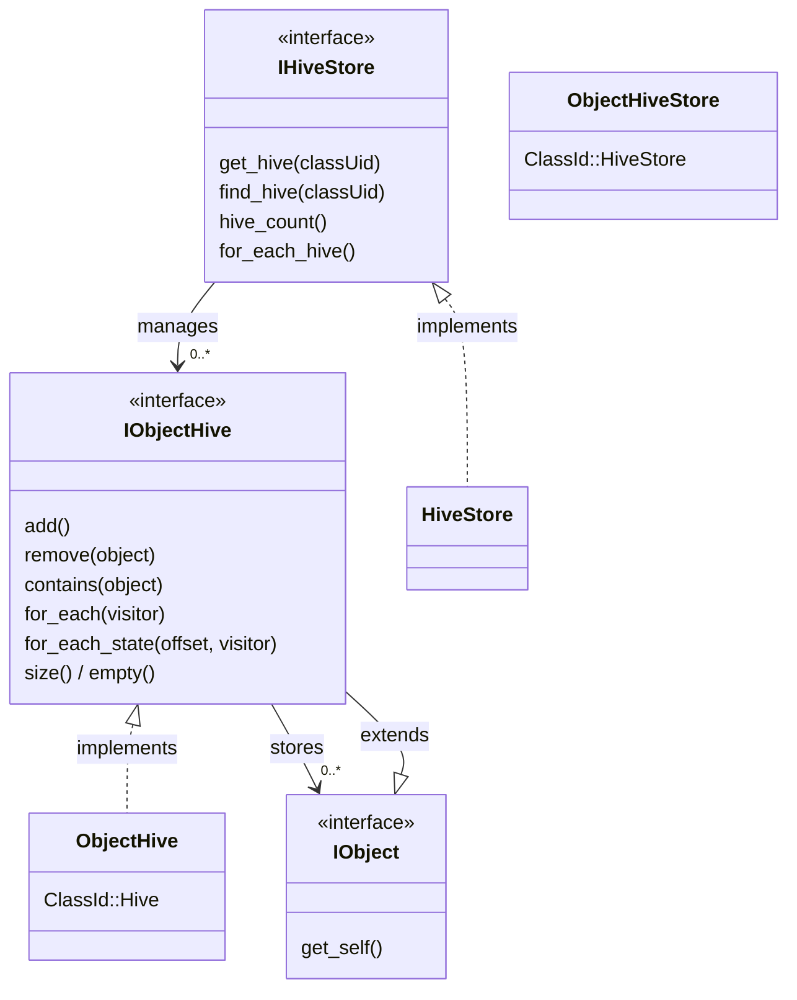
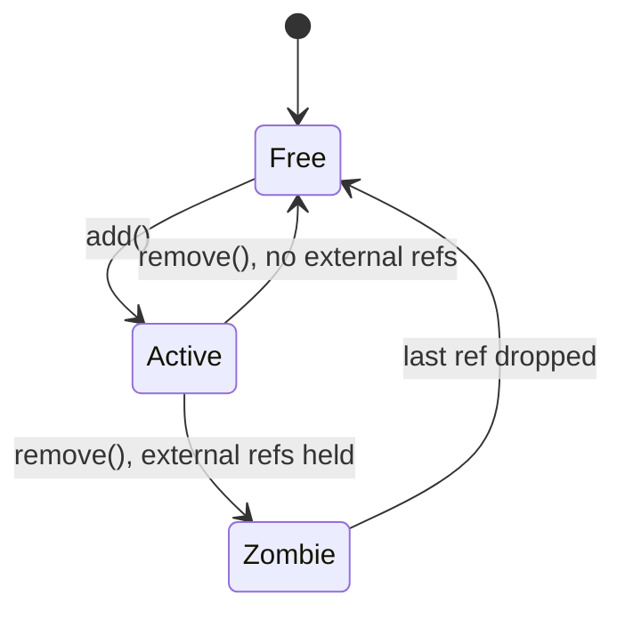

# Hive

A hive is a dense, typed container that stores objects of a single class contiguously in memory. Instead of allocating each object individually on the heap, a hive groups objects into cache-friendly pages and constructs them in place. This is useful for systems that manage large numbers of homogeneous objects (entities, particles, nodes) where iteration performance matters.

The design shares core ideas with C++26's `std::hive` (P0447): paged allocation, O(1) erase via a per-page freelist, stable references across insertion and removal, and no element shifting. Where `std::hive` is a general-purpose standard container, Velk's hive is specialized for Velk objects, providing reference counting, interface dispatch, metadata, and zombie/orphan lifetime management on top of the same underlying storage model.

Objects in a hive are full Velk objects with reference counting, metadata, and interface support. They can be passed around as `IObject::Ptr` just like any other object. The only difference is where they live in memory, and that removed objects can [outlive the hive itself](#lifetime-and-zombies) if external references still hold them.

## Contents

- [Class diagram](#class-diagram)
- [Getting started](#getting-started)
- [Hive store](#hive-store)
- [Adding objects](#adding-objects)
- [Removing objects](#removing-objects)
- [Iterating objects](#iterating-objects)
- [Checking membership](#checking-membership)
- [Object flags](#object-flags)
- [Lifetime and zombies](#lifetime-and-zombies)
- [Thread safety](#thread-safety)
- [Memory layout](#memory-layout)
- [Performance](#performance)

## Class diagram



## Getting started

The hive system is built into Velk. No setup is required. Create a hive store and start adding objects:

```cpp
#include <velk/interface/hive/intf_hive_store.h>

auto& velk = instance();
auto registry = velk.create<IHiveStore>(ClassId::HiveStore);

// Get (or create) a hive for MyWidget objects
auto hive = registry->get_hive<MyWidget>();

// Add objects
auto obj = hive->add();
```

## Hive store

The hive store manages hives, one per class UID. Create one via `ClassId::HiveStore` and use the `IHiveStore` interface for lazy creation and lookup:

```cpp
auto registry = instance().create<IHiveStore>(ClassId::HiveStore);

// get_hive: returns the hive for the class, creating it if needed
auto hive = registry->get_hive(MyWidget::class_id());

// find_hive: returns the hive if it exists, nullptr otherwise
auto hive = registry->find_hive(MyWidget::class_id());

// Templated versions (use T::class_id() internally)
auto hive = registry->get_hive<MyWidget>();
auto hive = registry->find_hive<MyWidget>();
```

You can enumerate all active hives:

```cpp
registry->hive_count();  // number of active hives

registry->for_each_hive(nullptr, [](void*, IObjectHive& hive) -> bool {
    // hive.get_element_class_uid(), hive.size(), ...
    return true;  // return false to stop early
});
```

Multiple hive stores can coexist independently. Each store maintains its own set of hives.

## Adding objects

`IObjectHive::add()` constructs a new object in the hive and returns a shared pointer:

```cpp
auto hive = registry->get_hive<MyWidget>();

IObject::Ptr obj = hive->add();
auto widget = interface_pointer_cast<IMyWidget>(obj);
widget->width().set_value(200.f);
```

The returned pointer behaves identically to one from `instance().create()`. The object has metadata, supports `interface_cast`, and participates in reference counting.

## Removing objects

`IObjectHive::remove()` removes an object from the hive:

```cpp
hive->remove(*obj);
```

After removal, the object's slot becomes available for reuse. If external references to the object still exist, the object stays alive until the last reference is dropped (see [Lifetime and zombies](#lifetime-and-zombies)).

## Iterating objects

The `api/hive/iterate.h` header provides `for_each_hive` overloads that accept capturing lambdas directly, avoiding the C-style `void* context` + function pointer pattern on the raw `IObjectHive` interface.

```cpp
#include <velk/api/hive/iterate.h>
```

The basic overload iterates all live objects:

```cpp
for_each_hive(*hive, [&](IObject& obj) {
    auto* widget = interface_cast<IMyWidget>(&obj);
    // ...
    return true;  // return false to stop early
});
```

Objects are stored contiguously within pages, so iteration has good cache locality compared to individually heap-allocated objects. Both iteration paths prefetch the next active slot before calling the visitor to reduce cache stalls.

### State iteration

When every element needs access to the same interface's property state (the common case for bulk updates, physics ticks, rendering passes, etc.), the state overload eliminates the per-element `interface_cast` and virtual `get_property_state()` calls entirely:

```cpp
for_each_hive<IMyWidget>(*hive, [&](IObject& obj, IMyWidget::State& s) {
    sum += s.width + s.height;
    return true;
});
```

Because all objects in a hive share the same class layout, the byte offset from object start to `IMyWidget::State` is the same for every element. `for_each_hive<T>` computes that offset once from the first live object, then passes a direct `State&` to the visitor via pointer arithmetic. No virtual calls happen inside the hot loop.

This matters when the visitor body is cheap relative to the dispatch overhead. For a visitor that reads 10 fields, the state path is roughly 40% faster than the `interface_cast` path (see [Performance](#performance)). If the visitor already does expensive work per element (allocations, I/O, deep call chains), the dispatch cost is negligible and either overload works fine.

### Low-level API

The typed overloads wrap `IObjectHive::for_each()` and `IObjectHive::for_each_state()`. You can call these directly if you need to cache the state offset across multiple iterations or pass through a C-style context pointer:

```cpp
// Compute offset from any live object in the hive.
ptrdiff_t offset = -1;
hive->for_each(&offset, [](void* ctx, IObject& obj) -> bool {
    auto* ps = interface_cast<IPropertyState>(&obj);
    void* state = ps->get_property_state(IMyWidget::UID);
    if (state) {
        *static_cast<ptrdiff_t*>(ctx) = static_cast<ptrdiff_t>(
            reinterpret_cast<uintptr_t>(state) - reinterpret_cast<uintptr_t>(&obj));
    }
    return false; // stop after first
});

// Use the cached offset for repeated iterations.
hive->for_each_state(offset, &my_ctx, [](void* ctx, IObject& obj, void* state) -> bool {
    auto& s = *static_cast<IMyWidget::State*>(state);
    // ...
    return true;
});
```

## Checking membership

```cpp
hive->contains(*obj);  // true if the object is in this hive
hive->size();           // number of live objects
hive->empty();          // true if no objects
```

## Object flags

Objects created by a hive have the `ObjectFlags::HiveManaged` flag set. This allows code to check whether an object is hive-managed without needing a reference to the hive:

```cpp
if (obj->get_object_flags() & ObjectFlags::HiveManaged) {
    // object was created by a hive
}
```

## Lifetime and zombies

A hive holds one strong reference to each of its objects. When you call `add()`, the returned `IObject::Ptr` is a second strong reference. The hive's internal reference keeps the object alive even if the caller drops their pointer.

When `remove()` is called, the hive releases its strong reference. If no external references remain, the object is destroyed immediately and the slot is recycled. If external references still exist, the object enters a **zombie** state: it is no longer visible to `for_each()` or counted by `size()`, but it remains alive in its slot until the last reference is dropped.

When the last reference to a zombie drops, the destructor runs in place and the slot is returned to the page's free list for reuse.

When a hive is destroyed (e.g. its store is released), all active objects are released. Any objects that still have external references become orphans. The underlying page memory is kept alive until the last orphan is destroyed, then freed automatically.

### Slot lifecycle

Each slot in a hive page transitions through three states:



## Thread safety

The hive uses a `shared_mutex` internally to protect its state. Mutating and read-only operations acquire the appropriate lock automatically:

| Operation | Lock |
|---|---|
| `add()` | exclusive |
| `remove()` | exclusive |
| `for_each()`, `for_each_state()` | shared |
| `contains()` | shared |
| `size()`, `empty()` | none (read a single counter) |

Multiple threads can safely call any combination of these operations concurrently. Readers (`for_each`, `contains`) run in parallel with each other, while writers (`add`, `remove`) are serialized and block readers.

If a `for_each` visitor attempts to call `add()` or `remove()` on the same hive, the exclusive lock request will deadlock against the shared lock already held by `for_each`. This is intentional: it turns what would otherwise be silent undefined behavior into an immediate, diagnosable hang.

```cpp
// Safe: two threads adding concurrently
// Thread A                    // Thread B
hive->add();                   hive->add();

// Safe: iterating while another thread adds
// Thread A                    // Thread B
for_each_hive(*hive, ...);     hive->add();   // blocks until iteration finishes

// Deadlock (by design): mutating from inside a visitor
for_each_hive(*hive, [&](IObject& obj) {
    hive->remove(obj);  // deadlock: exclusive lock vs. held shared lock
    return true;
});
```

When a removed object's last external reference is dropped from any thread, the slot reclamation callback acquires an exclusive lock to safely modify the freelist and bitmask. This blocks if iteration is in progress, ensuring the page state stays consistent.

Slot reclamation for orphaned pages (pages that outlive their hive) is lock-free because the owning hive and its mutex no longer exist.

## Memory layout

Objects are stored in chunked pages. Each page is a contiguous, aligned allocation sized for a fixed number of slots. Pages grow as needed:

| Page | Slot count |
|------|-----------|
| 1st  | 16        |
| 2nd  | 64        |
| 3rd  | 256       |
| 4th+ | 1024      |

Free slots within a page are linked through an intrusive free list stored in the slot memory itself, so there is no per-slot overhead for free slots. Each page also maintains a per-slot state byte (`Active`, `Zombie`, or `Free`), an active-slot bitmask (one bit per slot, packed into `uint64_t` words), and a contiguous array of embedded control blocks.

Slot reuse is LIFO within a page: the most recently freed slot is the next one allocated. This keeps active objects as dense as possible within each page.

## Performance

The tables below compare four configurations using 512 objects with 10 members (5 floats + 5 ints):

1. **Plain struct** -- `std::vector<PlainData>` (a class with constructor-initialized members, 40 bytes).
2. **Heap object** -- `std::vector<unique_ptr<HeapBase>>` of individually heap-allocated objects with a virtual base class and virtual destructor (a more typical OOP pattern).
3. **Velk vector** -- `std::vector<IObject::Ptr>` of individually heap-allocated Velk objects.
4. **Hive** -- Velk objects stored contiguously in a hive.

Both Velk benchmarks use `get_property_state<T>()` for direct state access. The "Hive state" row uses `for_each_hive<T>()` which pre-computes the state offset once and avoids per-element `interface_cast`. No metadata containers are allocated (lazy init is never triggered).

Measured on an x64 desktop (16 cores, 32 MiB L3). MSVC Release build, Google Benchmark. The benchmark source is in `benchmark/main.cpp` (search for `BM_Churn`, `BM_Create`, `BM_Iterate`, `BM_Memory`).

### Memory

| | Per-element | 512 items |
|---|---|---|
| Plain struct | 40 bytes | 20,480 bytes |
| Velk object | 128 bytes | ~65,536 bytes + control blocks |

The per-object overhead (88 bytes) covers the MI base layout (vtable pointers), ObjectData (flags + control block pointer), the lazy metadata pointer, and state tuple alignment padding. Both Velk vector and hive objects have the same per-element size.

### Creation (512 items)

| | Time | Ratio |
|---|---|---|
| `vector<PlainData>(512)` | ~608 ns | 1x |
| Heap object `make_unique` x 512 | ~14,228 ns | ~23x |
| Hive `add()` x 512 | ~10,414 ns | ~17x |
| Velk vector `create()` x 512 | ~39,274 ns | ~65x |

The hive is roughly 1.4x faster than plain heap-allocated objects and 3.8x faster than Velk heap allocation because it uses placement-new into pre-allocated pages and embeds control blocks directly in the page allocation, eliminating all per-object heap allocations. The hive's `add()` acquires an exclusive lock per call; in single-threaded benchmarks this adds a small constant overhead.

### Iteration: read all 10 fields (512 items)

| | Time | Ratio |
|---|---|---|
| Plain vector | ~648 ns | 1x |
| Heap object vector | ~707 ns | ~1.1x |
| Hive state (`for_each_hive`) | ~2,297 ns | ~3.5x |
| Hive + `interface_cast` | ~3,699 ns | ~5.7x |
| Velk vector + `get_property_state` | ~4,946 ns | ~7.6x |

### Iteration: write all 10 fields (512 items)

| | Time | Ratio |
|---|---|---|
| Plain vector | ~650 ns | 1x |
| Heap object vector | ~652 ns | ~1.0x |
| Hive state (`for_each_hive`) | ~2,457 ns | ~3.8x |
| Hive + `interface_cast` | ~3,983 ns | ~6.1x |
| Velk vector + `get_property_state` | ~4,876 ns | ~7.5x |

The heap object vector iterates nearly as fast as the plain vector in these benchmarks because `make_unique` in a tight loop produces nearly contiguous allocations. In a real application with interleaved allocations, heap objects would be scattered across memory and iteration would suffer more cache misses.

The hive's contiguous page layout gives it ~1.3x better iteration performance than a vector of individually heap-allocated Velk objects. Using `for_each_hive<T>()` adds another ~40% speedup on top by eliminating per-element `interface_cast` (~8 ns) and virtual `get_property_state()` (~2 ns) calls; the state offset is computed once and applied via pointer arithmetic. Both iteration paths acquire a shared lock for the duration of the call, then use prefetching to load the next active slot's cache line before calling the visitor, and a per-page active bitmask (`uint64_t` words scanned with `_BitScanForward64`) to skip empty/free slots in bulk.

### Churn: erase every 4th element + repopulate (512 items, pre-populated)

| | Time | Ratio |
|---|---|---|
| Hive (remove + add) | ~5,790 ns | 1x |
| Plain vector | ~7,514 ns | ~1.3x |
| Plain vector (locked) | ~9,384 ns | ~1.6x |
| Heap object vector (locked) | ~18,444 ns | ~3.2x |
| Heap object vector | ~20,423 ns | ~3.5x |
| Velk vector (erase + create) | ~28,974 ns | ~5.0x |

The "locked" rows wrap each erase and insert in a `std::mutex` lock, matching the per-operation locking the hive performs internally. For thread-safe churn workloads the hive is ~1.6x faster than a locked plain vector and ~3.2x faster than a locked heap object vector. Vector erase shifts all subsequent elements on each removal (O(n) per erase). The hive flips a state byte, clears an active bit, and pushes the slot onto the freelist (O(1) per remove), then repopulation reuses freed slots via LIFO with no reallocation or element shifting. With embedded control blocks, repopulation has zero heap allocations. The heap object vector pays the O(n) shift cost plus per-object `new`/`delete`, while the Velk vector adds Velk object construction overhead on top of that.

### Summary

For the iteration and creation overhead you get: reference-counted lifetime with `shared_ptr`/`weak_ptr` support, runtime interface dispatch, type-erased metadata available on demand, O(1) removal with slot reuse, zombie/orphan safety, thread-safe mutation, and `ObjectFlags::HiveManaged` tagging. Compared to a typical heap-allocated OOP class (virtual base, `unique_ptr`), the hive is ~1.4x faster for creation and ~3.2x faster for churn (locked). Compared to heap-allocated Velk objects, the hive is ~3.8x faster for creation, ~1.3x faster for iteration (or ~2x with `for_each_hive`), and ~5x faster for churn. For workloads with frequent add/remove churn, the hive outperforms all alternatives including a locked plain `std::vector` of structs, thanks to O(1) removal and zero-allocation slot reuse.
