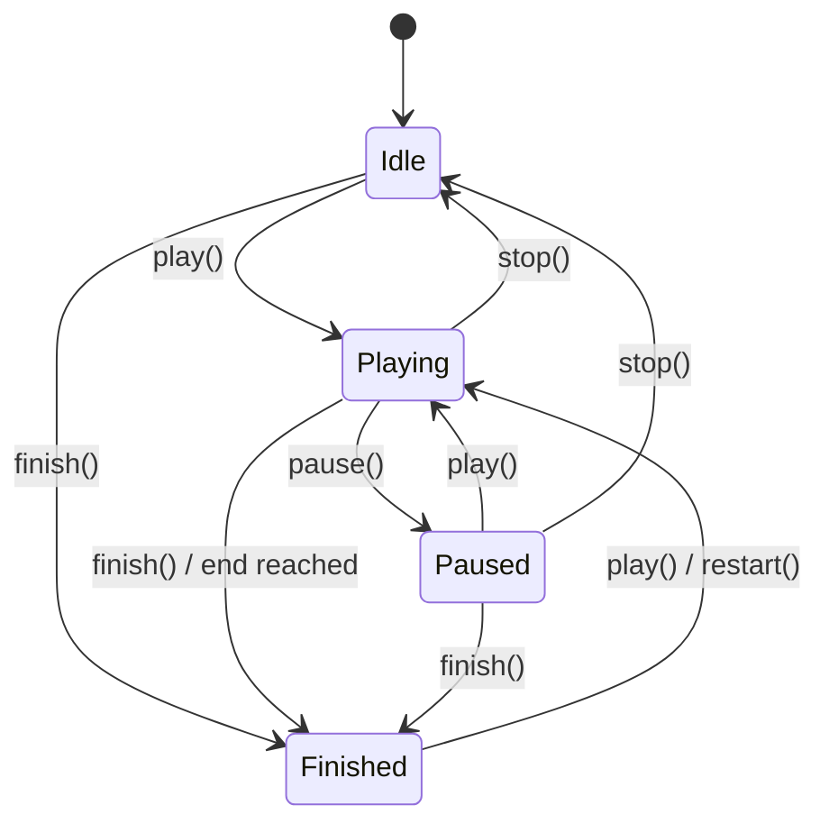
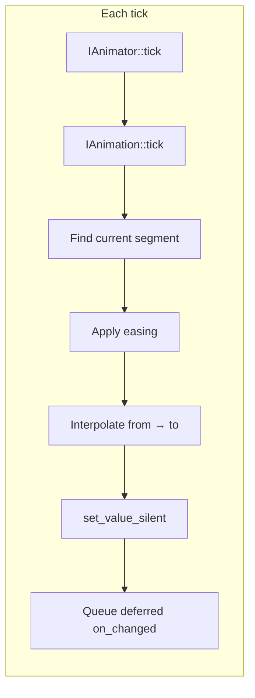
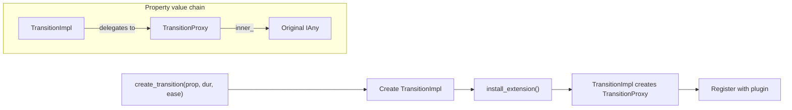
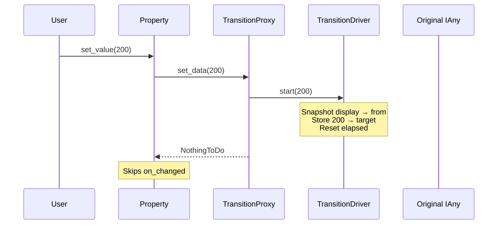
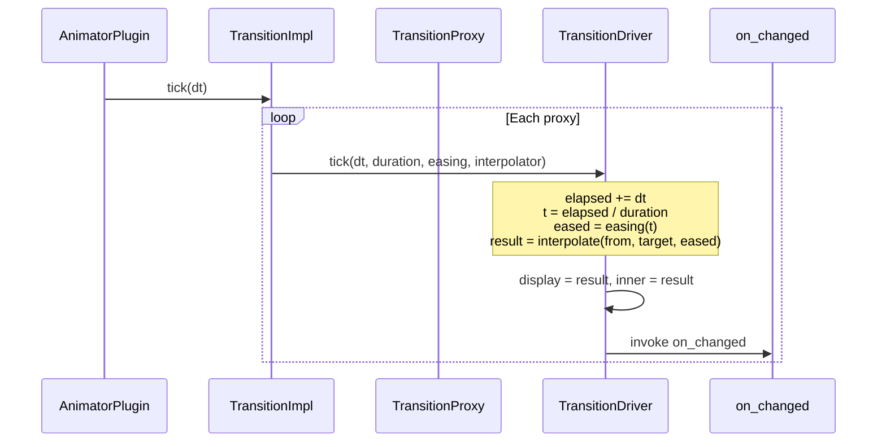

# Animator plugin

The animator plugin (`velk_animator`) provides property animation for Velk. It supports explicit animations (tweens, multi-keyframe tracks) with full playback control, and implicit animations (transitions) that automatically animate any value change on a property.

## Contents

- [Loading the plugin](#loading-the-plugin)
- [Explicit animations](#explicit-animations)
  - [Tweens](#tweens)
  - [Tween from current value](#tween-from-current-value)
  - [Multi-keyframe tracks](#multi-keyframe-tracks)
  - [Multi-target animations](#multi-target-animations)
  - [Playback control](#playback-control)
  - [The animator](#the-animator)
  - [Default animator](#default-animator)
- [Implicit animations (transitions)](#implicit-animations-transitions)
  - [Installing a transition](#installing-a-transition)
  - [Multi-target transitions](#multi-target-transitions)
  - [Retargeting](#retargeting)
  - [Removing a transition](#removing-a-transition)
  - [Modifying a transition](#modifying-a-transition)
- [Easing functions](#easing-functions)
- [Interpolation](#interpolation)
  - [Built-in interpolators](#built-in-interpolators)
  - [Custom interpolators](#custom-interpolators)
- [How it works](#how-it-works)

## Loading the plugin

The plugin is loaded automatically when you first call any animation API function. You can also load and unload it explicitly through the plugin registry:

```cpp
#include <velk/plugins/animator/api/animator.h>

// Load
instance().plugin_registry().load_plugin(PluginId::AnimatorPlugin);

// Unload (calls shutdown, sweeps registered types and interpolators)
instance().plugin_registry().unload_plugin(PluginId::AnimatorPlugin);
```

All animation API functions are in the `velk` namespace and available through `<velk/plugins/animator/api/animator.h>`.

## Explicit animations

Explicit animations drive a property from one value to another over a specified duration. You create them, add them to an animator, and they advance each time the animator is ticked.

### Tweens

`create_tween()` creates a simple from-to animation on a property:

```cpp
auto widget = instance().create<IMyWidget>(MyWidget::class_id());

// Animate width from 0 to 100 over 500ms
auto anim = velk::create_tween(
    velk::default_animator(),
    widget->width(),            // target property
    0.f,                        // from
    100.f,                      // to
    Duration{500},              // duration in milliseconds
    easing::out_quad            // easing (optional, default: linear)
);
```

The returned `Animation` handle holds a strong reference. The animation starts playing immediately.

### Tween from current value

`create_tween_to()` reads the property's current value as the start:

```cpp
// Animate from whatever width is now, to 200
auto anim = velk::create_tween_to(
    velk::default_animator(),
    widget->width(),
    200.f,
    Duration{300}
);
```

### Multi-keyframe tracks

`create_track()` creates an animation with multiple keyframes. Each keyframe specifies a time, value, and optional easing for the segment arriving at that keyframe:

```cpp
Keyframe<float> keyframes[] = {
    { Duration{0},    0.f,   easing::linear   },  // start at 0
    { Duration{200},  100.f, easing::in_quad   },  // ease in to 100 at 200ms
    { Duration{500},  50.f,  easing::out_cubic  },  // ease out to 50 at 500ms
};

auto anim = velk::create_track(
    velk::default_animator(),
    widget->width(),
    array_view<Keyframe<float>>{keyframes, 3}
);
```

The total duration is determined by the last keyframe's time. Each segment interpolates between adjacent keyframes using the destination keyframe's easing function.

### Multi-target animations

An animation can drive multiple properties with the same keyframes. Create a targetless animation and add targets before playing:

```cpp
auto anim = velk::create_tween(
    velk::default_animator(),
    0.f, 100.f,              // from, to (no target property)
    Duration{500}
);

anim.add_target(widget->width());
anim.add_target(widget->height());
anim.play();
```

You can add and remove targets at any time, including mid-animation:

```cpp
anim.remove_target(widget->height());  // height stops updating
```

### Playback control

The `Animation` handle provides full control over playback:

```cpp
anim.pause();        // freeze at current position
anim.play();         // resume from current position
anim.stop();         // reset to beginning (Idle state)
anim.finish();       // jump to end, apply final value (Finished state)
anim.restart();      // reset to beginning and start playing
anim.seek(0.5f);     // jump to normalized position (0..1)
```

Query the animation state:

```cpp
anim.is_playing();   // true while advancing
anim.is_paused();    // true if paused
anim.is_idle();      // true before first play, or after stop()
anim.is_finished();  // true after reaching the end or finish()

anim.get_duration(); // total duration
anim.get_elapsed();  // elapsed time
anim.get_progress(); // normalized progress (0..1)
```

The underlying `IAnimation` also exposes `duration`, `elapsed`, `progress`, and `state` as observable properties, so you can attach change handlers:

```cpp
auto ianim = anim.get_animation_interface();
ianim->progress().on_changed().add_handler([](){ /* progress updated */ });
ianim->state().on_changed().add_handler([](){ /* state changed */ });
```

**Playback states:**



`seek()` applies an interpolated value at any position without changing the playback state. `restart()` resets to the beginning and starts playing from any state.

### The animator

`IAnimator` manages a collection of animations and advances them each frame:

```cpp
auto obj = instance().create<IObject>(ClassId::Animator);
auto* animator = interface_cast<IAnimator>(obj);

// Tick manually
animator->tick(update_info);

// Manage animations
animator->add(animation_ptr);
animator->remove(animation_ptr);
animator->cancel_all();
animator->active_count();  // number currently playing
animator->count();         // total managed
```

### Default animator

The plugin provides a default animator that is ticked automatically during `instance().update()`:

```cpp
IAnimator& animator = velk::default_animator();
```

When you use `create_tween()`, `create_tween_to()`, or `create_track()` with `default_animator()`, animations advance automatically without any manual ticking. Just call `instance().update()` in your frame loop.

## Implicit animations (transitions)

Transitions make a property animate automatically whenever its value changes. Instead of jumping to the new value, the property smoothly interpolates from the old value to the new one over the specified duration.

### Installing a transition

```cpp
auto t = velk::create_transition(
    widget->width(),     // target property
    Duration{300},       // duration
    easing::out_quad     // easing (optional, default: linear)
);

// Now any set_value call animates:
widget->width().set_value(200.f);  // smoothly animates from current to 200
```

The returned `Transition` handle holds a strong reference. The transition stays active as long as the handle is alive.

Transitions are ticked automatically during `instance().update()`.

You can also install a transition by calling `install_extension` directly on a property:

```cpp
auto obj = instance().create<IObject>(ClassId::Transition);
auto tr = interface_pointer_cast<ITransition>(obj);
tr->duration().set_value(Duration{300});

auto* pi = interface_cast<IPropertyInternal>(widget->width().get_property_interface().get());
pi->install_extension(interface_pointer_cast<IAnyExtension>(tr));
```

### Multi-target transitions

A single transition can animate multiple properties with the same duration and easing. Create a targetless transition and add targets:

```cpp
auto t = velk::create_transition(
    Duration{300},       // duration
    easing::out_quad     // easing
);

t.add_target(widget->width());
t.add_target(widget->height());
t.add_target(widget->opacity());

// Setting any of these properties now animates:
widget->width().set_value(200.f);
widget->height().set_value(100.f);
widget->opacity().set_value(0.5f);
```

Each property animates independently (its own from/to/elapsed state) but shares the transition's duration and easing.

You can remove individual targets:

```cpp
t.remove_target(widget->opacity());  // opacity now updates immediately
```

### Retargeting

If you set the property again while a transition is in-flight, the animation retargets smoothly from wherever it currently is to the new value:

```cpp
widget->width().set_value(200.f);  // starts animating toward 200

// ... some time later, before the animation finishes ...
widget->width().set_value(50.f);   // retargets: now animates from current position toward 50
```

The retarget preserves continuity. The "from" value becomes whatever the display value is at the moment of retarget, ensuring no visual jumps.

### Removing a transition

Either call `remove()` or let the handle go out of scope:

```cpp
t.remove();                        // explicit removal
// or just let t go out of scope
```

After removal, `set_value` takes effect immediately as normal.

Note: `remove()` calls `uninstall()` to eagerly detach from properties. This is necessary because when a transition is installed on a property, the property holds a strong reference to the extension, which would otherwise keep the transition alive.

### Modifying a transition

You can change the duration and easing on a live transition:

```cpp
t.set_duration(Duration{500});
t.set_easing(easing::in_out_cubic);
```

Changes apply to all targets. In-flight animations on any target will use the new duration and easing from their next tick.

Query the current state:

```cpp
t.is_animating();    // true if any target is mid-animation
t.get_duration();    // current duration
```

## Easing functions

All easing functions live in the `velk::easing` namespace. Each maps a normalized time `t` in `[0, 1]` to an interpolation value. The naming follows the standard convention used by [easings.net](https://easings.net/) (`in_quad` = easeInQuad, `out_cubic` = easeOutCubic, etc.). See that site for interactive curve visualizations.

```cpp
#include <velk/plugins/animator/easing.h>
```

| Function | easings.net |
|---|---|
| `linear` | |
| `in_quad`, `out_quad`, `in_out_quad` | easeInQuad, easeOutQuad, easeInOutQuad |
| `in_cubic`, `out_cubic`, `in_out_cubic` | easeInCubic, easeOutCubic, easeInOutCubic |
| `in_sine`, `out_sine`, `in_out_sine` | easeInSine, easeOutSine, easeInOutSine |
| `in_expo`, `out_expo`, `in_out_expo` | easeInExpo, easeOutExpo, easeInOutExpo |
| `in_elastic`, `out_elastic` | easeInElastic, easeOutElastic |
| `in_bounce`, `out_bounce` | easeInBounce, easeOutBounce |

The easing function signature is `float (*)(float)`:

```cpp
using EasingFn = float (*)(float);
```

You can pass any function pointer matching this signature as a custom easing.

## Interpolation

### Built-in interpolators

The plugin registers interpolators for all standard numeric types on initialization:

`float`, `double`, `uint8_t`, `uint16_t`, `uint32_t`, `uint64_t`, `int8_t`, `int16_t`, `int32_t`, `int64_t`

The default interpolation formula is linear: `a + (b - a) * t`, where `a` is the start value, `b` is the end value, and `t` is the eased progress.

### Custom interpolators

To animate a custom type, write an interpolator function matching the `InterpolatorFn` signature and register it with the type registry:

```cpp
#include <velk/plugins/animator/interpolator_traits.h>

struct Vec2 { float x, y; };

// Option 1: specialize interpolator_trait and use the typed_interpolator helper
template <>
struct velk::interpolator_trait<Vec2>
{
    static Vec2 interpolate(const Vec2& a, const Vec2& b, float t)
    {
        return { a.x + (b.x - a.x) * t,
                 a.y + (b.y - a.y) * t };
    }
};

// Register with the type registry
instance().type_registry().register_interpolator<Vec2>(
    &detail::typed_interpolator<Vec2>);
```

You can also register a raw `InterpolatorFn` directly without using `interpolator_trait`:

```cpp
// InterpolatorFn = ReturnValue (*)(const IAny& from, const IAny& to, float t, IAny& result)
instance().type_registry().register_interpolator(
    type_uid<Vec2>(), my_vec2_interpolator);
```

The interpolator must be registered before the type is used with `create_tween()`, `create_track()`, or `create_transition()`. Transitions resolve the interpolator at install time from the property's type UID.

## How it works

### Explicit animations



An `IAnimation` holds a list of `KeyframeEntry` values and a list of target properties. Each tick, the animation computes the current segment, applies the segment's easing function to get a progress value, and calls the registered interpolator to produce the intermediate value. The result is written to all targets via `copy_from`, which bypasses `set_data` (so installed transitions are not triggered). The animation then queues a deferred `on_changed` notification so listeners see the update.

The `IAnimator` manages a collection of `IAnimation` objects, ticking all playing animations each frame.

### Implicit animations (transitions)

Transitions use the [IAnyExtension](../advanced.md#ianyextension-stacking-values-on-a-property) mechanism to intercept property value writes at the storage level.

**Architecture:**

A `TransitionImpl` manages one or more `TransitionProxy` objects. Each proxy is a lightweight `IAnyExtension` installed on a single property, containing a `TransitionDriver` that holds the per-property animation state (display, from, target, and result buffers, plus elapsed time).

Both paths create proxies:
- `create_transition(prop, ...)` installs the TransitionImpl as an extension, which internally creates a proxy
- `create_transition(dur, ...)` + `add_target(prop)` creates a proxy directly on each target property

**Installation:**



**Write interception:**



When user code calls `set_value`, the property calls `set_data` on the proxy. The proxy delegates to its driver's `start()` method, which snapshots the current display value as "from", stores the new value as "target", resets elapsed time, and returns `NothingToDo` so the property skips its normal `on_changed` notification.

**Tick loop:**



Each frame during `instance().update()`, the plugin ticks all registered transitions. The `TransitionImpl::tick` iterates its proxy children, passing its own duration and easing to each driver. Each driver advances its elapsed time, applies the easing function, and calls the interpolator to blend between "from" and "target". The interpolated result becomes both the display value and the inner value. The property's `on_changed` fires with the interpolated value.

If `set_value` is called again while animating, the animation retargets: the current display becomes the new "from" and the incoming value becomes the new "target", with elapsed reset to zero.

**Removal:** When `uninstall()` is called (via `Transition::remove()` or the destructor), all proxies are removed from their properties via `remove_extension()`, restoring normal write behavior. For directly installed transitions, the TransitionImpl itself is also removed from the property chain.

This design means transitions are transparent to the rest of the system. Code that reads or observes the property sees smoothly interpolated values without any changes to how it interacts with properties.
